# public.user

## Columns

| Name | Type | Default | Nullable | Children | Parents | Comment |
| ---- | ---- | ------- | -------- | -------- | ------- | ------- |
| id | uuid | gen_random_uuid() | false | [public.auth_identity](public.auth_identity.md) [public.project](public.project.md) [public.project_relation](public.project_relation.md) [public.user_api_keys](public.user_api_keys.md) [public.chat_hub_sessions](public.chat_hub_sessions.md) [public.chat_hub_agents](public.chat_hub_agents.md) [public.oauth_authorization_codes](public.oauth_authorization_codes.md) [public.oauth_access_tokens](public.oauth_access_tokens.md) [public.oauth_refresh_tokens](public.oauth_refresh_tokens.md) [public.oauth_user_consents](public.oauth_user_consents.md) [public.workflow_publish_history](public.workflow_publish_history.md) [public.dynamic_credential_user_entry](public.dynamic_credential_user_entry.md) [public.chat_hub_tools](public.chat_hub_tools.md) [public.workflow_builder_session](public.workflow_builder_session.md) [public.user_favorites](public.user_favorites.md) [public.evaluation_collection](public.evaluation_collection.md) [public.agent_history](public.agent_history.md) [public.instance_ai_pending_confirmations](public.instance_ai_pending_confirmations.md) [public.instance_ai_mcp_registry_connections](public.instance_ai_mcp_registry_connections.md) |  |  |
| email | varchar(255) |  | true |  |  |  |
| firstName | varchar(32) |  | true |  |  |  |
| lastName | varchar(32) |  | true |  |  |  |
| password | varchar(255) |  | true |  |  |  |
| personalizationAnswers | json |  | true |  |  |  |
| createdAt | timestamp(3) with time zone | CURRENT_TIMESTAMP(3) | false |  |  |  |
| updatedAt | timestamp(3) with time zone | CURRENT_TIMESTAMP(3) | false |  |  |  |
| settings | json |  | true |  |  |  |
| disabled | boolean | false | false |  |  |  |
| mfaEnabled | boolean | false | false |  |  |  |
| mfaSecret | text |  | true |  |  |  |
| mfaRecoveryCodes | text |  | true |  |  |  |
| lastActiveAt | date |  | true |  |  |  |
| roleSlug | varchar(128) | 'global:member'::character varying | false |  | [public.role](public.role.md) |  |

## Constraints

| Name | Type | Definition |
| ---- | ---- | ---------- |
| user_createdAt_not_null | n | NOT NULL "createdAt" |
| user_disabled_not_null | n | NOT NULL disabled |
| user_id_not_null | n | NOT NULL id |
| user_mfaEnabled_not_null | n | NOT NULL "mfaEnabled" |
| user_roleSlug_not_null | n | NOT NULL "roleSlug" |
| user_updatedAt_not_null | n | NOT NULL "updatedAt" |
| PK_ea8f538c94b6e352418254ed6474a81f | PRIMARY KEY | PRIMARY KEY (id) |
| UQ_e12875dfb3b1d92d7d7c5377e2 | UNIQUE | UNIQUE (email) |
| FK_eaea92ee7bfb9c1b6cd01505d56 | FOREIGN KEY | FOREIGN KEY ("roleSlug") REFERENCES role(slug) |

## Indexes

| Name | Definition |
| ---- | ---------- |
| PK_ea8f538c94b6e352418254ed6474a81f | CREATE UNIQUE INDEX "PK_ea8f538c94b6e352418254ed6474a81f" ON public."user" USING btree (id) |
| UQ_e12875dfb3b1d92d7d7c5377e2 | CREATE UNIQUE INDEX "UQ_e12875dfb3b1d92d7d7c5377e2" ON public."user" USING btree (email) |
| user_role_idx | CREATE INDEX user_role_idx ON public."user" USING btree ("roleSlug") |

## Relations

```mermaid
erDiagram

"public.auth_identity" }o--o| "public.user" : "FOREIGN KEY (#quot;userId#quot;) REFERENCES #quot;user#quot;(id)"
"public.project" }o--o| "public.user" : "FOREIGN KEY (#quot;creatorId#quot;) REFERENCES #quot;user#quot;(id) ON DELETE SET NULL"
"public.project_relation" }o--|| "public.user" : "FOREIGN KEY (#quot;userId#quot;) REFERENCES #quot;user#quot;(id) ON DELETE CASCADE"
"public.user_api_keys" }o--|| "public.user" : "FOREIGN KEY (#quot;userId#quot;) REFERENCES #quot;user#quot;(id) ON DELETE CASCADE"
"public.chat_hub_sessions" }o--|| "public.user" : "FOREIGN KEY (#quot;ownerId#quot;) REFERENCES #quot;user#quot;(id) ON DELETE CASCADE"
"public.chat_hub_agents" }o--|| "public.user" : "FOREIGN KEY (#quot;ownerId#quot;) REFERENCES #quot;user#quot;(id) ON DELETE CASCADE"
"public.oauth_authorization_codes" }o--|| "public.user" : "FOREIGN KEY (#quot;userId#quot;) REFERENCES #quot;user#quot;(id) ON DELETE CASCADE"
"public.oauth_access_tokens" }o--|| "public.user" : "FOREIGN KEY (#quot;userId#quot;) REFERENCES #quot;user#quot;(id) ON DELETE CASCADE"
"public.oauth_refresh_tokens" }o--|| "public.user" : "FOREIGN KEY (#quot;userId#quot;) REFERENCES #quot;user#quot;(id) ON DELETE CASCADE"
"public.oauth_user_consents" }o--|| "public.user" : "FOREIGN KEY (#quot;userId#quot;) REFERENCES #quot;user#quot;(id) ON DELETE CASCADE"
"public.workflow_publish_history" }o--o| "public.user" : "FOREIGN KEY (#quot;userId#quot;) REFERENCES #quot;user#quot;(id) ON DELETE SET NULL"
"public.dynamic_credential_user_entry" }o--|| "public.user" : "FOREIGN KEY (#quot;userId#quot;) REFERENCES #quot;user#quot;(id) ON DELETE CASCADE"
"public.chat_hub_tools" }o--|| "public.user" : "FOREIGN KEY (#quot;ownerId#quot;) REFERENCES #quot;user#quot;(id) ON DELETE CASCADE"
"public.workflow_builder_session" }o--|| "public.user" : "FOREIGN KEY (#quot;userId#quot;) REFERENCES #quot;user#quot;(id) ON DELETE CASCADE"
"public.user_favorites" }o--|| "public.user" : "FOREIGN KEY (#quot;userId#quot;) REFERENCES #quot;user#quot;(id) ON DELETE CASCADE"
"public.evaluation_collection" }o--o| "public.user" : "FOREIGN KEY (#quot;createdById#quot;) REFERENCES #quot;user#quot;(id) ON DELETE SET NULL"
"public.agent_history" }o--o| "public.user" : "FOREIGN KEY (#quot;publishedById#quot;) REFERENCES #quot;user#quot;(id) ON DELETE SET NULL"
"public.instance_ai_pending_confirmations" }o--|| "public.user" : "FOREIGN KEY (#quot;userId#quot;) REFERENCES #quot;user#quot;(id) ON DELETE CASCADE"
"public.instance_ai_mcp_registry_connections" }o--|| "public.user" : "FOREIGN KEY (#quot;userId#quot;) REFERENCES #quot;user#quot;(id) ON DELETE CASCADE"
"public.user" }o--|| "public.role" : "FOREIGN KEY (#quot;roleSlug#quot;) REFERENCES role(slug)"

"public.user" {
  uuid id
  varchar_255_ email
  varchar_32_ firstName
  varchar_32_ lastName
  varchar_255_ password
  json personalizationAnswers
  timestamp_3__with_time_zone createdAt
  timestamp_3__with_time_zone updatedAt
  json settings
  boolean disabled
  boolean mfaEnabled
  text mfaSecret
  text mfaRecoveryCodes
  date lastActiveAt
  varchar_128_ roleSlug FK
}
"public.auth_identity" {
  uuid userId FK
  varchar_255_ providerId
  varchar_32_ providerType
  timestamp_3__with_time_zone createdAt
  timestamp_3__with_time_zone updatedAt
}
"public.project" {
  varchar_36_ id
  varchar_255_ name
  varchar_36_ type
  timestamp_3__with_time_zone createdAt
  timestamp_3__with_time_zone updatedAt
  json icon
  varchar_512_ description
  uuid creatorId FK
  json customTelemetryTags
}
"public.project_relation" {
  varchar_36_ projectId FK
  uuid userId FK
  varchar role FK
  timestamp_3__with_time_zone createdAt
  timestamp_3__with_time_zone updatedAt
}
"public.user_api_keys" {
  varchar_36_ id
  uuid userId FK
  varchar_100_ label
  varchar apiKey
  timestamp_3__with_time_zone createdAt
  timestamp_3__with_time_zone updatedAt
  json scopes
  varchar audience
  timestamp_3__with_time_zone lastUsedAt
}
"public.chat_hub_sessions" {
  uuid id
  varchar_256_ title
  uuid ownerId FK
  timestamp_3__with_time_zone lastMessageAt
  varchar_36_ credentialId FK
  varchar_16_ provider
  varchar_256_ model
  varchar_36_ workflowId FK
  timestamp_3__with_time_zone createdAt
  timestamp_3__with_time_zone updatedAt
  uuid agentId FK
  varchar_128_ agentName
  varchar_16_ type
}
"public.chat_hub_agents" {
  uuid id
  varchar_256_ name
  varchar_512_ description
  text systemPrompt
  uuid ownerId FK
  varchar_36_ credentialId FK
  varchar_16_ provider
  varchar_64_ model
  timestamp_3__with_time_zone createdAt
  timestamp_3__with_time_zone updatedAt
  json icon
  json files
  json suggestedPrompts
}
"public.oauth_authorization_codes" {
  varchar_255_ code
  varchar clientId FK
  uuid userId FK
  varchar redirectUri
  varchar codeChallenge
  varchar_255_ codeChallengeMethod
  bigint expiresAt
  varchar state
  boolean used
  timestamp_3__with_time_zone createdAt
  timestamp_3__with_time_zone updatedAt
  varchar resource
  json scope
}
"public.oauth_access_tokens" {
  varchar token
  varchar clientId FK
  uuid userId FK
}
"public.oauth_refresh_tokens" {
  varchar_255_ token
  varchar clientId FK
  uuid userId FK
  bigint expiresAt
  timestamp_3__with_time_zone createdAt
  timestamp_3__with_time_zone updatedAt
  json scope
}
"public.oauth_user_consents" {
  integer id
  uuid userId FK
  varchar clientId FK
  bigint grantedAt
}
"public.workflow_publish_history" {
  integer id
  varchar_36_ workflowId FK
  varchar_36_ versionId FK
  varchar_36_ event
  uuid userId FK
  timestamp_3__with_time_zone createdAt
}
"public.dynamic_credential_user_entry" {
  varchar_16_ credentialId FK
  uuid userId FK
  varchar_16_ resolverId FK
  text data
  timestamp_3__with_time_zone createdAt
  timestamp_3__with_time_zone updatedAt
}
"public.chat_hub_tools" {
  uuid id
  varchar_255_ name
  varchar_255_ type
  double_precision typeVersion
  uuid ownerId FK
  json definition
  boolean enabled
  timestamp_3__with_time_zone createdAt
  timestamp_3__with_time_zone updatedAt
}
"public.workflow_builder_session" {
  uuid id
  varchar_36_ workflowId FK
  uuid userId FK
  json messages
  text previousSummary
  timestamp_3__with_time_zone createdAt
  timestamp_3__with_time_zone updatedAt
  varchar_255_ activeVersionCardId
  varchar_255_ resumeAfterRestoreMessageId
}
"public.user_favorites" {
  integer id
  uuid userId FK
  varchar_255_ resourceId
  varchar_64_ resourceType
}
"public.evaluation_collection" {
  varchar_36_ id
  varchar_128_ name
  text description
  varchar_36_ workflowId FK
  varchar_36_ evaluationConfigId FK
  uuid createdById FK
  json insightsCache
  timestamp_3__with_time_zone createdAt
  timestamp_3__with_time_zone updatedAt
}
"public.agent_history" {
  varchar_36_ versionId
  varchar_36_ agentId FK
  json schema
  json tools
  json skills
  uuid publishedById FK
  varchar_255_ author
  timestamp_3__with_time_zone createdAt
  timestamp_3__with_time_zone updatedAt
}
"public.instance_ai_pending_confirmations" {
  varchar_36_ requestId
  uuid threadId FK
  uuid userId FK
  varchar_16_ kind
  varchar_36_ runId
  varchar_64_ toolCallId
  varchar_36_ messageGroupId
  varchar_255_ checkpointKey FK
  varchar_36_ checkpointTaskId
  timestamp_3__with_time_zone expiresAt
  timestamp_3__with_time_zone createdAt
  timestamp_3__with_time_zone updatedAt
}
"public.instance_ai_mcp_registry_connections" {
  uuid id
  varchar_36_ credentialId FK
  varchar_255_ serverSlug FK
  json toolFilter
  uuid userId FK
  timestamp_3__with_time_zone createdAt
  timestamp_3__with_time_zone updatedAt
}
"public.role" {
  varchar_128_ slug
  text displayName
  text description
  text roleType
  boolean systemRole
  timestamp_3__with_time_zone createdAt
  timestamp_3__with_time_zone updatedAt
}
```

---

> Generated by [tbls](https://github.com/k1LoW/tbls)
