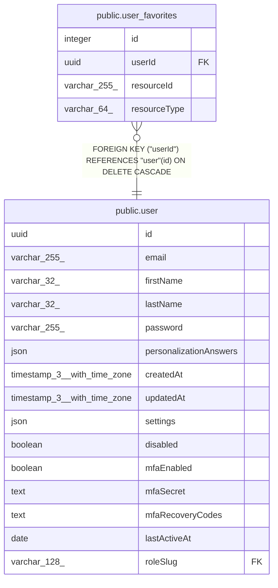

# public.user_favorites

## Columns

| Name | Type | Default | Nullable | Children | Parents | Comment |
| ---- | ---- | ------- | -------- | -------- | ------- | ------- |
| id | integer |  | false |  |  |  |
| userId | uuid |  | false |  | [public.user](public.user.md) |  |
| resourceId | varchar(255) |  | false |  |  |  |
| resourceType | varchar(64) |  | false |  |  |  |

## Constraints

| Name | Type | Definition |
| ---- | ---- | ---------- |
| user_favorites_id_not_null | n | NOT NULL id |
| user_favorites_resourceId_not_null | n | NOT NULL "resourceId" |
| user_favorites_resourceType_not_null | n | NOT NULL "resourceType" |
| user_favorites_userId_not_null | n | NOT NULL "userId" |
| FK_1dd5c393ad0517be3c31a7af836 | FOREIGN KEY | FOREIGN KEY ("userId") REFERENCES "user"(id) ON DELETE CASCADE |
| PK_6c472a19a7423cfbbf6b7c75939 | PRIMARY KEY | PRIMARY KEY (id) |
| UQ_cf6ae658ead9ffc124723413c65 | UNIQUE | UNIQUE ("userId", "resourceId", "resourceType") |

## Indexes

| Name | Definition |
| ---- | ---------- |
| PK_6c472a19a7423cfbbf6b7c75939 | CREATE UNIQUE INDEX "PK_6c472a19a7423cfbbf6b7c75939" ON public.user_favorites USING btree (id) |
| UQ_cf6ae658ead9ffc124723413c65 | CREATE UNIQUE INDEX "UQ_cf6ae658ead9ffc124723413c65" ON public.user_favorites USING btree ("userId", "resourceId", "resourceType") |
| IDX_1dd5c393ad0517be3c31a7af83 | CREATE INDEX "IDX_1dd5c393ad0517be3c31a7af83" ON public.user_favorites USING btree ("userId") |
| IDX_1d11050a381548c42c32cc25c4 | CREATE INDEX "IDX_1d11050a381548c42c32cc25c4" ON public.user_favorites USING btree ("resourceType", "resourceId") |

## Relations

---

> Generated by [tbls](https://github.com/k1LoW/tbls)
