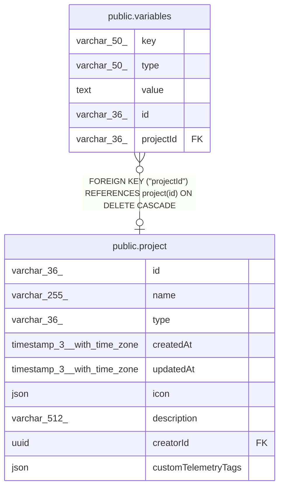

# public.variables

## Columns

| Name | Type | Default | Nullable | Children | Parents | Comment |
| ---- | ---- | ------- | -------- | -------- | ------- | ------- |
| key | varchar(50) |  | false |  |  |  |
| type | varchar(50) | 'string'::character varying | false |  |  |  |
| value | text |  | true |  |  |  |
| id | varchar(36) |  | false |  |  |  |
| projectId | varchar(36) |  | true |  | [public.project](public.project.md) |  |

## Constraints

| Name | Type | Definition |
| ---- | ---- | ---------- |
| variables_id_not_null1 | n | NOT NULL id |
| variables_key_not_null | n | NOT NULL key |
| variables_type_not_null | n | NOT NULL type |
| variables_value_max_len | CHECK | CHECK (((value IS NULL) OR (char_length(value) <= 1000))) |
| variables_pkey | PRIMARY KEY | PRIMARY KEY (id) |
| FK_42f6c766f9f9d2edcc15bdd6e9b | FOREIGN KEY | FOREIGN KEY ("projectId") REFERENCES project(id) ON DELETE CASCADE |

## Indexes

| Name | Definition |
| ---- | ---------- |
| variables_pkey | CREATE UNIQUE INDEX variables_pkey ON public.variables USING btree (id) |
| variables_project_key_unique | CREATE UNIQUE INDEX variables_project_key_unique ON public.variables USING btree ("projectId", key) WHERE ("projectId" IS NOT NULL) |
| variables_global_key_unique | CREATE UNIQUE INDEX variables_global_key_unique ON public.variables USING btree (key) WHERE ("projectId" IS NULL) |

## Relations

---

> Generated by [tbls](https://github.com/k1LoW/tbls)
