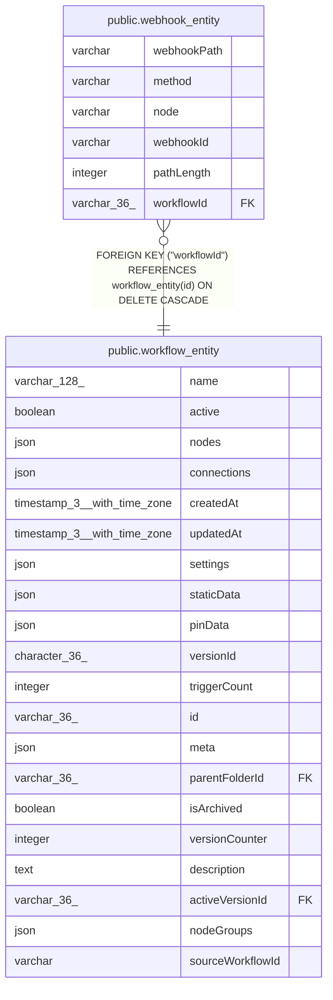

# public.webhook_entity

## Columns

| Name | Type | Default | Nullable | Children | Parents | Comment |
| ---- | ---- | ------- | -------- | -------- | ------- | ------- |
| webhookPath | varchar |  | false |  |  |  |
| method | varchar |  | false |  |  |  |
| node | varchar |  | false |  |  |  |
| webhookId | varchar |  | true |  |  |  |
| pathLength | integer |  | true |  |  |  |
| workflowId | varchar(36) |  | false |  | [public.workflow_entity](public.workflow_entity.md) |  |

## Constraints

| Name | Type | Definition |
| ---- | ---- | ---------- |
| webhook_entity_method_not_null | n | NOT NULL method |
| webhook_entity_node_not_null | n | NOT NULL node |
| webhook_entity_webhookPath_not_null | n | NOT NULL "webhookPath" |
| webhook_entity_workflowId_not_null1 | n | NOT NULL "workflowId" |
| PK_b21ace2e13596ccd87dc9bf4ea6 | PRIMARY KEY | PRIMARY KEY ("webhookPath", method) |
| fk_webhook_entity_workflow_id | FOREIGN KEY | FOREIGN KEY ("workflowId") REFERENCES workflow_entity(id) ON DELETE CASCADE |

## Indexes

| Name | Definition |
| ---- | ---------- |
| PK_b21ace2e13596ccd87dc9bf4ea6 | CREATE UNIQUE INDEX "PK_b21ace2e13596ccd87dc9bf4ea6" ON public.webhook_entity USING btree ("webhookPath", method) |
| idx_16f4436789e804e3e1c9eeb240 | CREATE INDEX idx_16f4436789e804e3e1c9eeb240 ON public.webhook_entity USING btree ("webhookId", method, "pathLength") |

## Relations

---

> Generated by [tbls](https://github.com/k1LoW/tbls)
