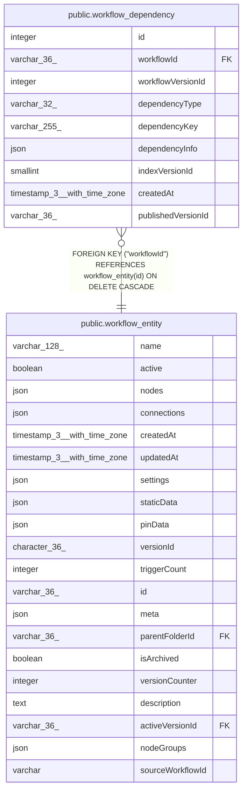

# public.workflow_dependency

## Columns

| Name | Type | Default | Nullable | Children | Parents | Comment |
| ---- | ---- | ------- | -------- | -------- | ------- | ------- |
| id | integer |  | false |  |  |  |
| workflowId | varchar(36) |  | false |  | [public.workflow_entity](public.workflow_entity.md) |  |
| workflowVersionId | integer |  | false |  |  | Version of the workflow |
| dependencyType | varchar(32) |  | false |  |  | Type of dependency: "credential", "nodeType", "webhookPath", or "workflowCall" |
| dependencyKey | varchar(255) |  | false |  |  | ID or name of the dependency |
| dependencyInfo | json |  | true |  |  | Additional info about the dependency, interpreted based on type |
| indexVersionId | smallint | 1 | false |  |  | Version of the index structure |
| createdAt | timestamp(3) with time zone | CURRENT_TIMESTAMP(3) | false |  |  |  |
| publishedVersionId | varchar(36) |  | true |  |  |  |

## Constraints

| Name | Type | Definition |
| ---- | ---- | ---------- |
| workflow_dependency_createdAt_not_null | n | NOT NULL "createdAt" |
| workflow_dependency_dependencyKey_not_null | n | NOT NULL "dependencyKey" |
| workflow_dependency_dependencyType_not_null | n | NOT NULL "dependencyType" |
| workflow_dependency_id_not_null | n | NOT NULL id |
| workflow_dependency_indexVersionId_not_null | n | NOT NULL "indexVersionId" |
| workflow_dependency_workflowId_not_null | n | NOT NULL "workflowId" |
| workflow_dependency_workflowVersionId_not_null | n | NOT NULL "workflowVersionId" |
| FK_a4ff2d9b9628ea988fa9e7d0bf8 | FOREIGN KEY | FOREIGN KEY ("workflowId") REFERENCES workflow_entity(id) ON DELETE CASCADE |
| PK_52325e34cd7a2f0f67b0f3cad65 | PRIMARY KEY | PRIMARY KEY (id) |

## Indexes

| Name | Definition |
| ---- | ---------- |
| PK_52325e34cd7a2f0f67b0f3cad65 | CREATE UNIQUE INDEX "PK_52325e34cd7a2f0f67b0f3cad65" ON public.workflow_dependency USING btree (id) |
| IDX_a4ff2d9b9628ea988fa9e7d0bf | CREATE INDEX "IDX_a4ff2d9b9628ea988fa9e7d0bf" ON public.workflow_dependency USING btree ("workflowId") |
| IDX_e7fe1cfda990c14a445937d0b9 | CREATE INDEX "IDX_e7fe1cfda990c14a445937d0b9" ON public.workflow_dependency USING btree ("dependencyType") |
| IDX_e48a201071ab85d9d09119d640 | CREATE INDEX "IDX_e48a201071ab85d9d09119d640" ON public.workflow_dependency USING btree ("dependencyKey") |
| IDX_workflow_dependency_publishedVersionId | CREATE INDEX "IDX_workflow_dependency_publishedVersionId" ON public.workflow_dependency USING btree ("publishedVersionId") |

## Relations

---

> Generated by [tbls](https://github.com/k1LoW/tbls)
