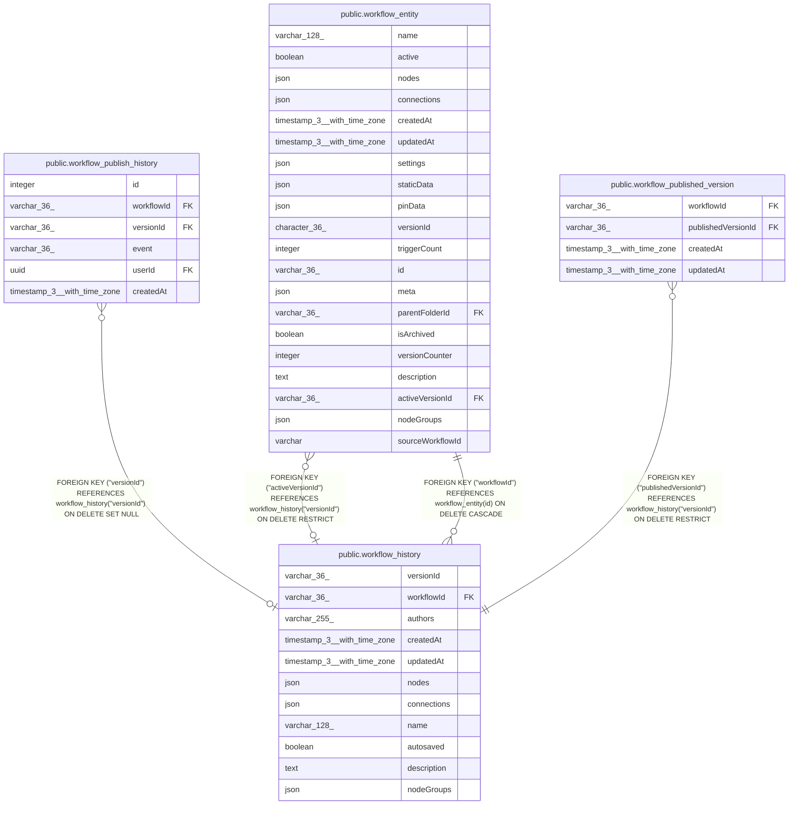

# public.workflow_history

## Columns

| Name | Type | Default | Nullable | Children | Parents | Comment |
| ---- | ---- | ------- | -------- | -------- | ------- | ------- |
| versionId | varchar(36) |  | false | [public.workflow_entity](public.workflow_entity.md) [public.workflow_publish_history](public.workflow_publish_history.md) [public.workflow_published_version](public.workflow_published_version.md) |  |  |
| workflowId | varchar(36) |  | false |  | [public.workflow_entity](public.workflow_entity.md) |  |
| authors | varchar(255) |  | false |  |  |  |
| createdAt | timestamp(3) with time zone | CURRENT_TIMESTAMP(3) | false |  |  |  |
| updatedAt | timestamp(3) with time zone | CURRENT_TIMESTAMP(3) | false |  |  |  |
| nodes | json |  | false |  |  |  |
| connections | json |  | false |  |  |  |
| name | varchar(128) |  | true |  |  |  |
| autosaved | boolean | false | false |  |  |  |
| description | text |  | true |  |  |  |
| nodeGroups | json | '[]'::json | false |  |  |  |

## Constraints

| Name | Type | Definition |
| ---- | ---- | ---------- |
| workflow_history_authors_not_null | n | NOT NULL authors |
| workflow_history_autosaved_not_null | n | NOT NULL autosaved |
| workflow_history_connections_not_null | n | NOT NULL connections |
| workflow_history_createdAt_not_null | n | NOT NULL "createdAt" |
| workflow_history_nodeGroups_not_null | n | NOT NULL "nodeGroups" |
| workflow_history_nodes_not_null | n | NOT NULL nodes |
| workflow_history_updatedAt_not_null | n | NOT NULL "updatedAt" |
| workflow_history_versionId_not_null | n | NOT NULL "versionId" |
| workflow_history_workflowId_not_null | n | NOT NULL "workflowId" |
| FK_1e31657f5fe46816c34be7c1b4b | FOREIGN KEY | FOREIGN KEY ("workflowId") REFERENCES workflow_entity(id) ON DELETE CASCADE |
| PK_b6572dd6173e4cd06fe79937b58 | PRIMARY KEY | PRIMARY KEY ("versionId") |

## Indexes

| Name | Definition |
| ---- | ---------- |
| PK_b6572dd6173e4cd06fe79937b58 | CREATE UNIQUE INDEX "PK_b6572dd6173e4cd06fe79937b58" ON public.workflow_history USING btree ("versionId") |
| IDX_1e31657f5fe46816c34be7c1b4 | CREATE INDEX "IDX_1e31657f5fe46816c34be7c1b4" ON public.workflow_history USING btree ("workflowId") |

## Relations

---

> Generated by [tbls](https://github.com/k1LoW/tbls)
