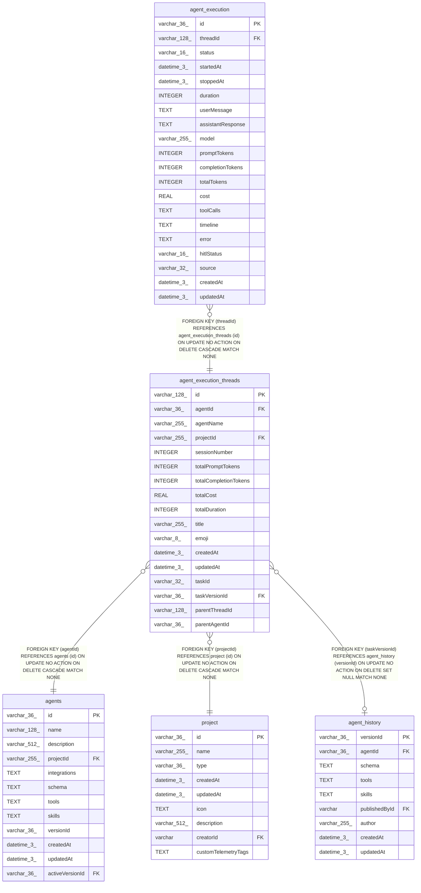

# agent_execution_threads

## Description

<details>
<summary><strong>Table Definition</strong></summary>

```sql
CREATE TABLE "agent_execution_threads" ("id" varchar(128) PRIMARY KEY NOT NULL, "agentId" varchar(36) NOT NULL, "agentName" varchar(255) NOT NULL, "projectId" varchar(255) NOT NULL, "sessionNumber" integer NOT NULL DEFAULT (0), "totalPromptTokens" integer NOT NULL DEFAULT (0), "totalCompletionTokens" integer NOT NULL DEFAULT (0), "totalCost" real NOT NULL DEFAULT (0), "totalDuration" integer NOT NULL DEFAULT (0), "title" varchar(255), "emoji" varchar(8), "createdAt" datetime(3) NOT NULL DEFAULT (STRFTIME('%Y-%m-%d %H:%M:%f', 'NOW')), "updatedAt" datetime(3) NOT NULL DEFAULT (STRFTIME('%Y-%m-%d %H:%M:%f', 'NOW')), "taskId" varchar(32), "taskVersionId" varchar(36), "parentThreadId" varchar(128), "parentAgentId" varchar(36), CONSTRAINT "FK_0e2f8bf92a7a9c88b89670f701c" FOREIGN KEY ("projectId") REFERENCES "project" ("id") ON DELETE CASCADE ON UPDATE NO ACTION, CONSTRAINT "FK_0468a9dc35597314e641d4722aa" FOREIGN KEY ("agentId") REFERENCES "agents" ("id") ON DELETE CASCADE ON UPDATE NO ACTION, CONSTRAINT "FK_f00b52d74fe11838e1fe086deea" FOREIGN KEY ("taskVersionId") REFERENCES "agent_history" ("versionId") ON DELETE SET NULL)
```

</details>

## Columns

| Name | Type | Default | Nullable | Children | Parents | Comment |
| ---- | ---- | ------- | -------- | -------- | ------- | ------- |
| id | varchar(128) |  | false | [agent_execution](agent_execution.md) |  |  |
| agentId | varchar(36) |  | false |  | [agents](agents.md) |  |
| agentName | varchar(255) |  | false |  |  |  |
| projectId | varchar(255) |  | false |  | [project](project.md) |  |
| sessionNumber | INTEGER | 0 | false |  |  |  |
| totalPromptTokens | INTEGER | 0 | false |  |  |  |
| totalCompletionTokens | INTEGER | 0 | false |  |  |  |
| totalCost | REAL | 0 | false |  |  |  |
| totalDuration | INTEGER | 0 | false |  |  |  |
| title | varchar(255) |  | true |  |  |  |
| emoji | varchar(8) |  | true |  |  |  |
| createdAt | datetime(3) | STRFTIME('%Y-%m-%d %H:%M:%f', 'NOW') | false |  |  |  |
| updatedAt | datetime(3) | STRFTIME('%Y-%m-%d %H:%M:%f', 'NOW') | false |  |  |  |
| taskId | varchar(32) |  | true |  |  |  |
| taskVersionId | varchar(36) |  | true |  | [agent_history](agent_history.md) |  |
| parentThreadId | varchar(128) |  | true |  |  |  |
| parentAgentId | varchar(36) |  | true |  |  |  |

## Constraints

| Name | Type | Definition |
| ---- | ---- | ---------- |
| id | PRIMARY KEY | PRIMARY KEY (id) |
| - (Foreign key ID: 0) | FOREIGN KEY | FOREIGN KEY (taskVersionId) REFERENCES agent_history (versionId) ON UPDATE NO ACTION ON DELETE SET NULL MATCH NONE |
| - (Foreign key ID: 1) | FOREIGN KEY | FOREIGN KEY (agentId) REFERENCES agents (id) ON UPDATE NO ACTION ON DELETE CASCADE MATCH NONE |
| - (Foreign key ID: 2) | FOREIGN KEY | FOREIGN KEY (projectId) REFERENCES project (id) ON UPDATE NO ACTION ON DELETE CASCADE MATCH NONE |
| sqlite_autoindex_agent_execution_threads_1 | PRIMARY KEY | PRIMARY KEY (id) |

## Indexes

| Name | Definition |
| ---- | ---------- |
| IDX_agent_execution_threads_taskVersionId | CREATE INDEX "IDX_agent_execution_threads_taskVersionId" ON "agent_execution_threads" ("taskVersionId")  |
| IDX_0468a9dc35597314e641d4722a | CREATE INDEX "IDX_0468a9dc35597314e641d4722a" ON "agent_execution_threads" ("agentId")  |
| IDX_0e2f8bf92a7a9c88b89670f701 | CREATE INDEX "IDX_0e2f8bf92a7a9c88b89670f701" ON "agent_execution_threads" ("projectId")  |
| sqlite_autoindex_agent_execution_threads_1 | PRIMARY KEY (id) |

## Relations



---

> Generated by [tbls](https://github.com/k1LoW/tbls)
