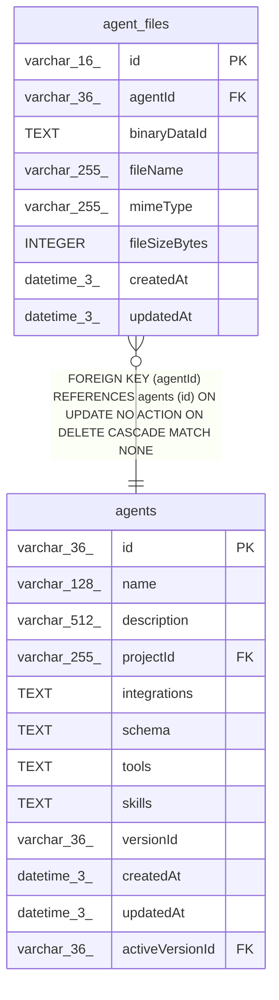

# agent_files

## Description

<details>
<summary><strong>Table Definition</strong></summary>

```sql
CREATE TABLE "agent_files" ("id" varchar(16) PRIMARY KEY NOT NULL, "agentId" varchar(36) NOT NULL, "binaryDataId" text NOT NULL, "fileName" varchar(255) NOT NULL, "mimeType" varchar(255) NOT NULL, "fileSizeBytes" integer NOT NULL, "createdAt" datetime(3) NOT NULL DEFAULT (STRFTIME('%Y-%m-%d %H:%M:%f', 'NOW')), "updatedAt" datetime(3) NOT NULL DEFAULT (STRFTIME('%Y-%m-%d %H:%M:%f', 'NOW')), CONSTRAINT "FK_aca4514cb500494b64356c2e164" FOREIGN KEY ("agentId") REFERENCES "agents" ("id") ON DELETE CASCADE)
```

</details>

## Columns

| Name | Type | Default | Nullable | Children | Parents | Comment |
| ---- | ---- | ------- | -------- | -------- | ------- | ------- |
| id | varchar(16) |  | false |  |  |  |
| agentId | varchar(36) |  | false |  | [agents](agents.md) |  |
| binaryDataId | TEXT |  | false |  |  |  |
| fileName | varchar(255) |  | false |  |  |  |
| mimeType | varchar(255) |  | false |  |  |  |
| fileSizeBytes | INTEGER |  | false |  |  |  |
| createdAt | datetime(3) | STRFTIME('%Y-%m-%d %H:%M:%f', 'NOW') | false |  |  |  |
| updatedAt | datetime(3) | STRFTIME('%Y-%m-%d %H:%M:%f', 'NOW') | false |  |  |  |

## Constraints

| Name | Type | Definition |
| ---- | ---- | ---------- |
| id | PRIMARY KEY | PRIMARY KEY (id) |
| - (Foreign key ID: 0) | FOREIGN KEY | FOREIGN KEY (agentId) REFERENCES agents (id) ON UPDATE NO ACTION ON DELETE CASCADE MATCH NONE |
| sqlite_autoindex_agent_files_1 | PRIMARY KEY | PRIMARY KEY (id) |

## Indexes

| Name | Definition |
| ---- | ---------- |
| IDX_45dafc48fe2ce95eac30fc8ffd | CREATE INDEX "IDX_45dafc48fe2ce95eac30fc8ffd" ON "agent_files" ("agentId", "createdAt")  |
| sqlite_autoindex_agent_files_1 | PRIMARY KEY (id) |

## Relations



---

> Generated by [tbls](https://github.com/k1LoW/tbls)
