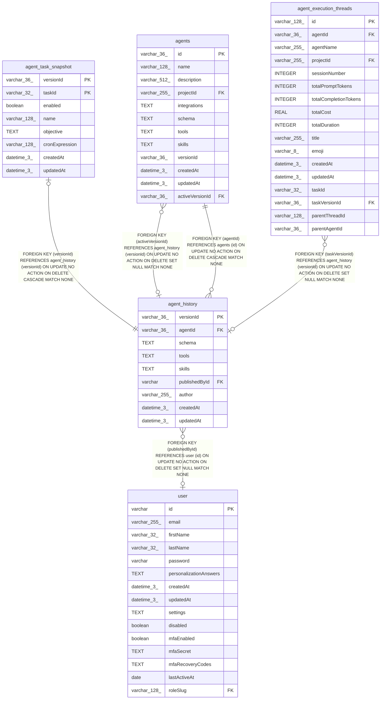

# agent_history

## Description

<details>
<summary><strong>Table Definition</strong></summary>

```sql
CREATE TABLE "agent_history" ("versionId" varchar(36) PRIMARY KEY NOT NULL, "agentId" varchar(36) NOT NULL, "schema" text, "tools" text, "skills" text, "publishedById" varchar, "author" varchar(255) NOT NULL, "createdAt" datetime(3) NOT NULL DEFAULT (STRFTIME('%Y-%m-%d %H:%M:%f', 'NOW')), "updatedAt" datetime(3) NOT NULL DEFAULT (STRFTIME('%Y-%m-%d %H:%M:%f', 'NOW')), CONSTRAINT "FK_87cd5a8da20304b089ea2f83fec" FOREIGN KEY ("agentId") REFERENCES "agents" ("id") ON DELETE CASCADE, CONSTRAINT "FK_8771675f44c58fb40e0feb9ee35" FOREIGN KEY ("publishedById") REFERENCES "user" ("id") ON DELETE SET NULL)
```

</details>

## Columns

| Name | Type | Default | Nullable | Children | Parents | Comment |
| ---- | ---- | ------- | -------- | -------- | ------- | ------- |
| versionId | varchar(36) |  | false | [agents](agents.md) [agent_task_snapshot](agent_task_snapshot.md) [agent_execution_threads](agent_execution_threads.md) |  |  |
| agentId | varchar(36) |  | false |  | [agents](agents.md) |  |
| schema | TEXT |  | true |  |  |  |
| tools | TEXT |  | true |  |  |  |
| skills | TEXT |  | true |  |  |  |
| publishedById | varchar |  | true |  | [user](user.md) |  |
| author | varchar(255) |  | false |  |  |  |
| createdAt | datetime(3) | STRFTIME('%Y-%m-%d %H:%M:%f', 'NOW') | false |  |  |  |
| updatedAt | datetime(3) | STRFTIME('%Y-%m-%d %H:%M:%f', 'NOW') | false |  |  |  |

## Constraints

| Name | Type | Definition |
| ---- | ---- | ---------- |
| versionId | PRIMARY KEY | PRIMARY KEY (versionId) |
| - (Foreign key ID: 0) | FOREIGN KEY | FOREIGN KEY (publishedById) REFERENCES user (id) ON UPDATE NO ACTION ON DELETE SET NULL MATCH NONE |
| - (Foreign key ID: 1) | FOREIGN KEY | FOREIGN KEY (agentId) REFERENCES agents (id) ON UPDATE NO ACTION ON DELETE CASCADE MATCH NONE |
| sqlite_autoindex_agent_history_1 | PRIMARY KEY | PRIMARY KEY (versionId) |

## Indexes

| Name | Definition |
| ---- | ---------- |
| IDX_87cd5a8da20304b089ea2f83fe | CREATE INDEX "IDX_87cd5a8da20304b089ea2f83fe" ON "agent_history" ("agentId")  |
| sqlite_autoindex_agent_history_1 | PRIMARY KEY (versionId) |

## Relations



---

> Generated by [tbls](https://github.com/k1LoW/tbls)
