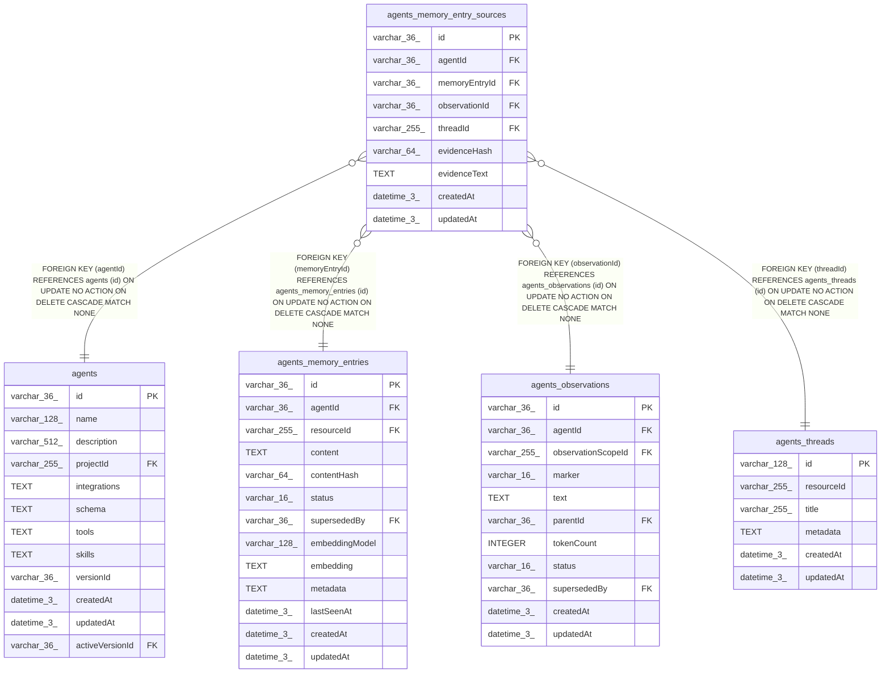

# agents_memory_entry_sources

## Description

<details>
<summary><strong>Table Definition</strong></summary>

```sql
CREATE TABLE "agents_memory_entry_sources" ("id" varchar(36) PRIMARY KEY NOT NULL, "agentId" varchar(36) NOT NULL, "memoryEntryId" varchar(36) NOT NULL, "observationId" varchar(36) NOT NULL, "threadId" varchar(255) NOT NULL, "evidenceHash" varchar(64) NOT NULL, "evidenceText" text NOT NULL, "createdAt" datetime(3) NOT NULL DEFAULT (STRFTIME('%Y-%m-%d %H:%M:%f', 'NOW')), "updatedAt" datetime(3) NOT NULL DEFAULT (STRFTIME('%Y-%m-%d %H:%M:%f', 'NOW')), CONSTRAINT "FK_c38e8a57a36b880e39a52ada2e8" FOREIGN KEY ("agentId") REFERENCES "agents" ("id") ON DELETE CASCADE, CONSTRAINT "FK_4706f6223313959b7437a2b48df" FOREIGN KEY ("memoryEntryId") REFERENCES "agents_memory_entries" ("id") ON DELETE CASCADE, CONSTRAINT "FK_cb7c15d22fd068a0806aa57fc03" FOREIGN KEY ("observationId") REFERENCES "agents_observations" ("id") ON DELETE CASCADE, CONSTRAINT "FK_451d387a182fa8dd8002dfc3a77" FOREIGN KEY ("threadId") REFERENCES "agents_threads" ("id") ON DELETE CASCADE)
```

</details>

## Columns

| Name | Type | Default | Nullable | Children | Parents | Comment |
| ---- | ---- | ------- | -------- | -------- | ------- | ------- |
| id | varchar(36) |  | false |  |  |  |
| agentId | varchar(36) |  | false |  | [agents](agents.md) |  |
| memoryEntryId | varchar(36) |  | false |  | [agents_memory_entries](agents_memory_entries.md) |  |
| observationId | varchar(36) |  | false |  | [agents_observations](agents_observations.md) |  |
| threadId | varchar(255) |  | false |  | [agents_threads](agents_threads.md) |  |
| evidenceHash | varchar(64) |  | false |  |  |  |
| evidenceText | TEXT |  | false |  |  |  |
| createdAt | datetime(3) | STRFTIME('%Y-%m-%d %H:%M:%f', 'NOW') | false |  |  |  |
| updatedAt | datetime(3) | STRFTIME('%Y-%m-%d %H:%M:%f', 'NOW') | false |  |  |  |

## Constraints

| Name | Type | Definition |
| ---- | ---- | ---------- |
| id | PRIMARY KEY | PRIMARY KEY (id) |
| - (Foreign key ID: 0) | FOREIGN KEY | FOREIGN KEY (threadId) REFERENCES agents_threads (id) ON UPDATE NO ACTION ON DELETE CASCADE MATCH NONE |
| - (Foreign key ID: 1) | FOREIGN KEY | FOREIGN KEY (observationId) REFERENCES agents_observations (id) ON UPDATE NO ACTION ON DELETE CASCADE MATCH NONE |
| - (Foreign key ID: 2) | FOREIGN KEY | FOREIGN KEY (memoryEntryId) REFERENCES agents_memory_entries (id) ON UPDATE NO ACTION ON DELETE CASCADE MATCH NONE |
| - (Foreign key ID: 3) | FOREIGN KEY | FOREIGN KEY (agentId) REFERENCES agents (id) ON UPDATE NO ACTION ON DELETE CASCADE MATCH NONE |
| sqlite_autoindex_agents_memory_entry_sources_1 | PRIMARY KEY | PRIMARY KEY (id) |

## Indexes

| Name | Definition |
| ---- | ---------- |
| IDX_451d387a182fa8dd8002dfc3a7 | CREATE INDEX "IDX_451d387a182fa8dd8002dfc3a7" ON "agents_memory_entry_sources" ("threadId")  |
| IDX_f9573af4ed653f13b0ba1f7b12 | CREATE INDEX "IDX_f9573af4ed653f13b0ba1f7b12" ON "agents_memory_entry_sources" ("agentId", "threadId")  |
| IDX_cb7c15d22fd068a0806aa57fc0 | CREATE INDEX "IDX_cb7c15d22fd068a0806aa57fc0" ON "agents_memory_entry_sources" ("observationId")  |
| IDX_a353ac251315ef0af6ad3c9f0a | CREATE UNIQUE INDEX "IDX_a353ac251315ef0af6ad3c9f0a" ON "agents_memory_entry_sources" ("memoryEntryId", "observationId", "evidenceHash")  |
| sqlite_autoindex_agents_memory_entry_sources_1 | PRIMARY KEY (id) |

## Relations



---

> Generated by [tbls](https://github.com/k1LoW/tbls)
