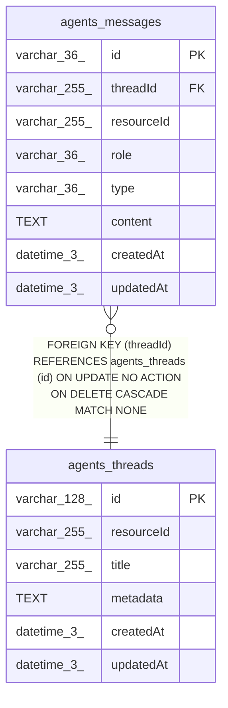

# agents_messages

## Description

<details>
<summary><strong>Table Definition</strong></summary>

```sql
CREATE TABLE "agents_messages" ("id" varchar(36) PRIMARY KEY NOT NULL, "threadId" varchar(255) NOT NULL, "resourceId" varchar(255) NOT NULL, "role" varchar(36) NOT NULL, "type" varchar(36), "content" text NOT NULL, "createdAt" datetime(3) NOT NULL DEFAULT (STRFTIME('%Y-%m-%d %H:%M:%f', 'NOW')), "updatedAt" datetime(3) NOT NULL DEFAULT (STRFTIME('%Y-%m-%d %H:%M:%f', 'NOW')), CONSTRAINT "FK_0a8057a61afabd2999608ffd0d9" FOREIGN KEY ("threadId") REFERENCES "agents_threads" ("id") ON DELETE CASCADE)
```

</details>

## Columns

| Name | Type | Default | Nullable | Children | Parents | Comment |
| ---- | ---- | ------- | -------- | -------- | ------- | ------- |
| id | varchar(36) |  | false |  |  |  |
| threadId | varchar(255) |  | false |  | [agents_threads](agents_threads.md) |  |
| resourceId | varchar(255) |  | false |  |  |  |
| role | varchar(36) |  | false |  |  |  |
| type | varchar(36) |  | true |  |  |  |
| content | TEXT |  | false |  |  |  |
| createdAt | datetime(3) | STRFTIME('%Y-%m-%d %H:%M:%f', 'NOW') | false |  |  |  |
| updatedAt | datetime(3) | STRFTIME('%Y-%m-%d %H:%M:%f', 'NOW') | false |  |  |  |

## Constraints

| Name | Type | Definition |
| ---- | ---- | ---------- |
| id | PRIMARY KEY | PRIMARY KEY (id) |
| - (Foreign key ID: 0) | FOREIGN KEY | FOREIGN KEY (threadId) REFERENCES agents_threads (id) ON UPDATE NO ACTION ON DELETE CASCADE MATCH NONE |
| sqlite_autoindex_agents_messages_1 | PRIMARY KEY | PRIMARY KEY (id) |

## Indexes

| Name | Definition |
| ---- | ---------- |
| IDX_agents_messages_threadId_createdAt | CREATE INDEX "IDX_agents_messages_threadId_createdAt" ON "agents_messages" ("threadId", "createdAt")  |
| IDX_fc7bf858660bfafd19181e8e35 | CREATE INDEX "IDX_fc7bf858660bfafd19181e8e35" ON "agents_messages" ("threadId", "createdAt")  |
| sqlite_autoindex_agents_messages_1 | PRIMARY KEY (id) |

## Relations



---

> Generated by [tbls](https://github.com/k1LoW/tbls)
