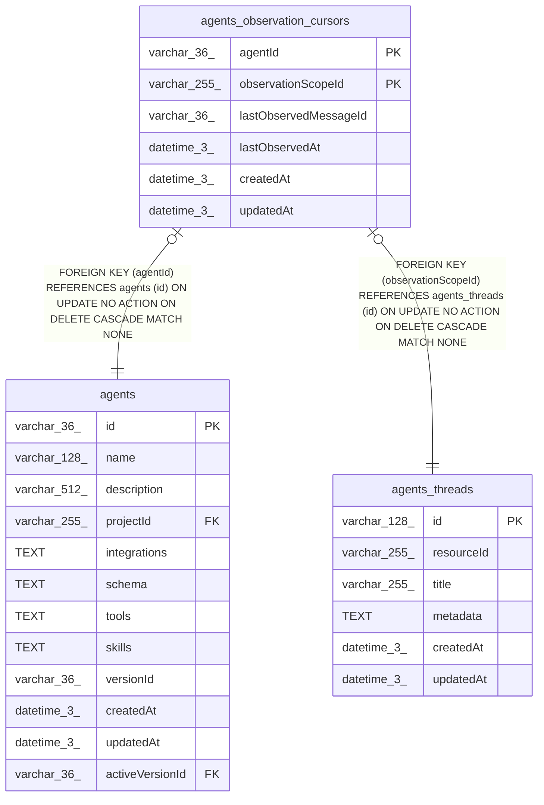

# agents_observation_cursors

## Description

<details>
<summary><strong>Table Definition</strong></summary>

```sql
CREATE TABLE "agents_observation_cursors" ("agentId" varchar(36) NOT NULL, "observationScopeId" varchar(255) NOT NULL, "lastObservedMessageId" varchar(36) NOT NULL, "lastObservedAt" datetime(3) NOT NULL, "createdAt" datetime(3) NOT NULL DEFAULT (STRFTIME('%Y-%m-%d %H:%M:%f', 'NOW')), "updatedAt" datetime(3) NOT NULL DEFAULT (STRFTIME('%Y-%m-%d %H:%M:%f', 'NOW')), CONSTRAINT "FK_64e92819f4b413661ed6e2c3c3d" FOREIGN KEY ("agentId") REFERENCES "agents" ("id") ON DELETE CASCADE, CONSTRAINT "FK_87aa187d27ea67eafd164905154" FOREIGN KEY ("observationScopeId") REFERENCES "agents_threads" ("id") ON DELETE CASCADE, PRIMARY KEY ("agentId", "observationScopeId"))
```

</details>

## Columns

| Name | Type | Default | Nullable | Children | Parents | Comment |
| ---- | ---- | ------- | -------- | -------- | ------- | ------- |
| agentId | varchar(36) |  | false |  | [agents](agents.md) |  |
| observationScopeId | varchar(255) |  | false |  | [agents_threads](agents_threads.md) |  |
| lastObservedMessageId | varchar(36) |  | false |  |  |  |
| lastObservedAt | datetime(3) |  | false |  |  |  |
| createdAt | datetime(3) | STRFTIME('%Y-%m-%d %H:%M:%f', 'NOW') | false |  |  |  |
| updatedAt | datetime(3) | STRFTIME('%Y-%m-%d %H:%M:%f', 'NOW') | false |  |  |  |

## Constraints

| Name | Type | Definition |
| ---- | ---- | ---------- |
| agentId | PRIMARY KEY | PRIMARY KEY (agentId) |
| observationScopeId | PRIMARY KEY | PRIMARY KEY (observationScopeId) |
| - (Foreign key ID: 0) | FOREIGN KEY | FOREIGN KEY (observationScopeId) REFERENCES agents_threads (id) ON UPDATE NO ACTION ON DELETE CASCADE MATCH NONE |
| - (Foreign key ID: 1) | FOREIGN KEY | FOREIGN KEY (agentId) REFERENCES agents (id) ON UPDATE NO ACTION ON DELETE CASCADE MATCH NONE |
| sqlite_autoindex_agents_observation_cursors_1 | PRIMARY KEY | PRIMARY KEY (agentId, observationScopeId) |

## Indexes

| Name | Definition |
| ---- | ---------- |
| IDX_87aa187d27ea67eafd16490515 | CREATE INDEX "IDX_87aa187d27ea67eafd16490515" ON "agents_observation_cursors" ("observationScopeId")  |
| sqlite_autoindex_agents_observation_cursors_1 | PRIMARY KEY (agentId, observationScopeId) |

## Relations



---

> Generated by [tbls](https://github.com/k1LoW/tbls)
