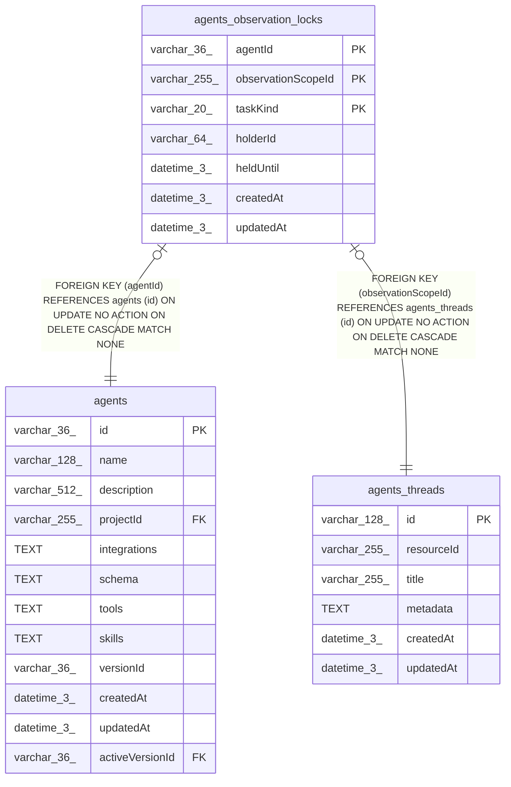

# agents_observation_locks

## Description

<details>
<summary><strong>Table Definition</strong></summary>

```sql
CREATE TABLE "agents_observation_locks" ("agentId" varchar(36) NOT NULL, "observationScopeId" varchar(255) NOT NULL, "taskKind" varchar(20) NOT NULL, "holderId" varchar(64) NOT NULL, "heldUntil" datetime(3) NOT NULL, "createdAt" datetime(3) NOT NULL DEFAULT (STRFTIME('%Y-%m-%d %H:%M:%f', 'NOW')), "updatedAt" datetime(3) NOT NULL DEFAULT (STRFTIME('%Y-%m-%d %H:%M:%f', 'NOW')), CONSTRAINT "CHK_agents_observation_locks_taskKind" CHECK ("taskKind" IN ('observer', 'reflector')), CONSTRAINT "FK_093e44ae20f2518e97d83a95433" FOREIGN KEY ("agentId") REFERENCES "agents" ("id") ON DELETE CASCADE, CONSTRAINT "FK_6b55089892e447c2f82e5ec60ed" FOREIGN KEY ("observationScopeId") REFERENCES "agents_threads" ("id") ON DELETE CASCADE, PRIMARY KEY ("agentId", "observationScopeId", "taskKind"))
```

</details>

## Columns

| Name | Type | Default | Nullable | Children | Parents | Comment |
| ---- | ---- | ------- | -------- | -------- | ------- | ------- |
| agentId | varchar(36) |  | false |  | [agents](agents.md) |  |
| observationScopeId | varchar(255) |  | false |  | [agents_threads](agents_threads.md) |  |
| taskKind | varchar(20) |  | false |  |  |  |
| holderId | varchar(64) |  | false |  |  |  |
| heldUntil | datetime(3) |  | false |  |  |  |
| createdAt | datetime(3) | STRFTIME('%Y-%m-%d %H:%M:%f', 'NOW') | false |  |  |  |
| updatedAt | datetime(3) | STRFTIME('%Y-%m-%d %H:%M:%f', 'NOW') | false |  |  |  |

## Constraints

| Name | Type | Definition |
| ---- | ---- | ---------- |
| agentId | PRIMARY KEY | PRIMARY KEY (agentId) |
| observationScopeId | PRIMARY KEY | PRIMARY KEY (observationScopeId) |
| taskKind | PRIMARY KEY | PRIMARY KEY (taskKind) |
| - (Foreign key ID: 0) | FOREIGN KEY | FOREIGN KEY (observationScopeId) REFERENCES agents_threads (id) ON UPDATE NO ACTION ON DELETE CASCADE MATCH NONE |
| - (Foreign key ID: 1) | FOREIGN KEY | FOREIGN KEY (agentId) REFERENCES agents (id) ON UPDATE NO ACTION ON DELETE CASCADE MATCH NONE |
| sqlite_autoindex_agents_observation_locks_1 | PRIMARY KEY | PRIMARY KEY (agentId, observationScopeId, taskKind) |
| - | CHECK | CHECK ("taskKind" IN ('observer', 'reflector')) |

## Indexes

| Name | Definition |
| ---- | ---------- |
| IDX_6b55089892e447c2f82e5ec60e | CREATE INDEX "IDX_6b55089892e447c2f82e5ec60e" ON "agents_observation_locks" ("observationScopeId")  |
| sqlite_autoindex_agents_observation_locks_1 | PRIMARY KEY (agentId, observationScopeId, taskKind) |

## Relations



---

> Generated by [tbls](https://github.com/k1LoW/tbls)
