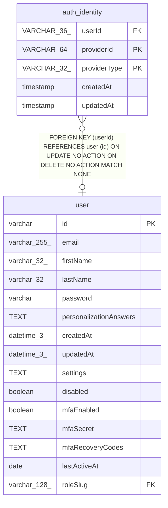

# auth_identity

## Description

<details>
<summary><strong>Table Definition</strong></summary>

```sql
CREATE TABLE "auth_identity" (
				"userId" VARCHAR(36) REFERENCES "user" (id),
				"providerId" VARCHAR(64) NOT NULL,
				"providerType" VARCHAR(32) NOT NULL,
				"createdAt" timestamp NOT NULL DEFAULT CURRENT_TIMESTAMP,
				"updatedAt" timestamp NOT NULL DEFAULT CURRENT_TIMESTAMP,
				PRIMARY KEY("providerId", "providerType")
			)
```

</details>

## Columns

| Name | Type | Default | Nullable | Children | Parents | Comment |
| ---- | ---- | ------- | -------- | -------- | ------- | ------- |
| userId | VARCHAR(36) |  | true |  | [user](user.md) |  |
| providerId | VARCHAR(64) |  | false |  |  |  |
| providerType | VARCHAR(32) |  | false |  |  |  |
| createdAt | timestamp | CURRENT_TIMESTAMP | false |  |  |  |
| updatedAt | timestamp | CURRENT_TIMESTAMP | false |  |  |  |

## Constraints

| Name | Type | Definition |
| ---- | ---- | ---------- |
| providerId | PRIMARY KEY | PRIMARY KEY (providerId) |
| providerType | PRIMARY KEY | PRIMARY KEY (providerType) |
| - (Foreign key ID: 0) | FOREIGN KEY | FOREIGN KEY (userId) REFERENCES user (id) ON UPDATE NO ACTION ON DELETE NO ACTION MATCH NONE |
| sqlite_autoindex_auth_identity_1 | PRIMARY KEY | PRIMARY KEY (providerId, providerType) |

## Indexes

| Name | Definition |
| ---- | ---------- |
| sqlite_autoindex_auth_identity_1 | PRIMARY KEY (providerId, providerType) |

## Relations



---

> Generated by [tbls](https://github.com/k1LoW/tbls)
