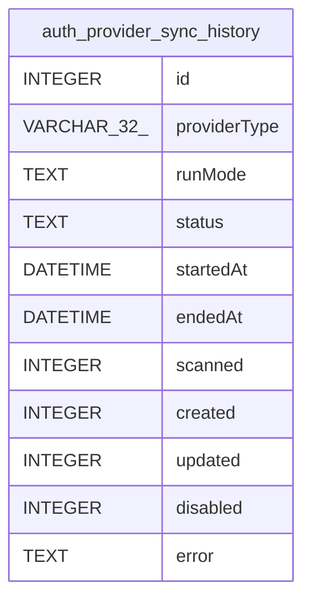

# auth_provider_sync_history

## Description

<details>
<summary><strong>Table Definition</strong></summary>

```sql
CREATE TABLE "auth_provider_sync_history" (
				"id" INTEGER PRIMARY KEY AUTOINCREMENT,
				"providerType" VARCHAR(32) NOT NULL,
				"runMode" TEXT NOT NULL,
				"status" TEXT NOT NULL,
				"startedAt" DATETIME NOT NULL,
				"endedAt" DATETIME NOT NULL,
				"scanned" INTEGER NOT NULL,
				"created" INTEGER NOT NULL,
				"updated" INTEGER NOT NULL,
				"disabled" INTEGER NOT NULL,
				"error" TEXT
			)
```

</details>

## Columns

| Name | Type | Default | Nullable | Children | Parents | Comment |
| ---- | ---- | ------- | -------- | -------- | ------- | ------- |
| id | INTEGER |  | true |  |  |  |
| providerType | VARCHAR(32) |  | false |  |  |  |
| runMode | TEXT |  | false |  |  |  |
| status | TEXT |  | false |  |  |  |
| startedAt | DATETIME |  | false |  |  |  |
| endedAt | DATETIME |  | false |  |  |  |
| scanned | INTEGER |  | false |  |  |  |
| created | INTEGER |  | false |  |  |  |
| updated | INTEGER |  | false |  |  |  |
| disabled | INTEGER |  | false |  |  |  |
| error | TEXT |  | true |  |  |  |

## Constraints

| Name | Type | Definition |
| ---- | ---- | ---------- |
| id | PRIMARY KEY | PRIMARY KEY (id) |

## Relations



---

> Generated by [tbls](https://github.com/k1LoW/tbls)
