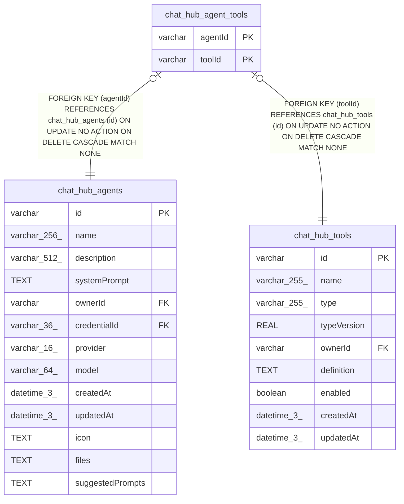

# chat_hub_agent_tools

## Description

<details>
<summary><strong>Table Definition</strong></summary>

```sql
CREATE TABLE "chat_hub_agent_tools" ("agentId" varchar NOT NULL, "toolId" varchar NOT NULL, CONSTRAINT "FK_2b53d796b3dbae91b1a9553c048" FOREIGN KEY ("agentId") REFERENCES "chat_hub_agents" ("id") ON DELETE CASCADE, CONSTRAINT "FK_43e70f04c53344f82483d0570f6" FOREIGN KEY ("toolId") REFERENCES "chat_hub_tools" ("id") ON DELETE CASCADE, PRIMARY KEY ("agentId", "toolId"))
```

</details>

## Columns

| Name | Type | Default | Nullable | Children | Parents | Comment |
| ---- | ---- | ------- | -------- | -------- | ------- | ------- |
| agentId | varchar |  | false |  | [chat_hub_agents](chat_hub_agents.md) |  |
| toolId | varchar |  | false |  | [chat_hub_tools](chat_hub_tools.md) |  |

## Constraints

| Name | Type | Definition |
| ---- | ---- | ---------- |
| agentId | PRIMARY KEY | PRIMARY KEY (agentId) |
| toolId | PRIMARY KEY | PRIMARY KEY (toolId) |
| - (Foreign key ID: 0) | FOREIGN KEY | FOREIGN KEY (toolId) REFERENCES chat_hub_tools (id) ON UPDATE NO ACTION ON DELETE CASCADE MATCH NONE |
| - (Foreign key ID: 1) | FOREIGN KEY | FOREIGN KEY (agentId) REFERENCES chat_hub_agents (id) ON UPDATE NO ACTION ON DELETE CASCADE MATCH NONE |
| sqlite_autoindex_chat_hub_agent_tools_1 | PRIMARY KEY | PRIMARY KEY (agentId, toolId) |

## Indexes

| Name | Definition |
| ---- | ---------- |
| sqlite_autoindex_chat_hub_agent_tools_1 | PRIMARY KEY (agentId, toolId) |

## Relations



---

> Generated by [tbls](https://github.com/k1LoW/tbls)
