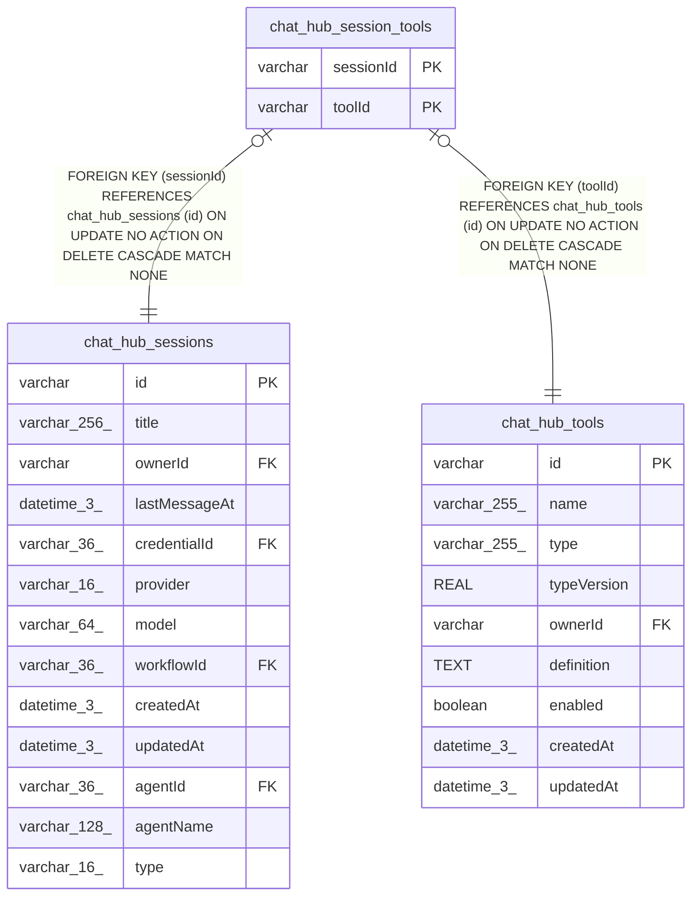

# chat_hub_session_tools

## Description

<details>
<summary><strong>Table Definition</strong></summary>

```sql
CREATE TABLE "chat_hub_session_tools" ("sessionId" varchar NOT NULL, "toolId" varchar NOT NULL, CONSTRAINT "FK_e649bf1295f4ed8d4299ed290f9" FOREIGN KEY ("sessionId") REFERENCES "chat_hub_sessions" ("id") ON DELETE CASCADE, CONSTRAINT "FK_6596a328affd8d4967ffb303eee" FOREIGN KEY ("toolId") REFERENCES "chat_hub_tools" ("id") ON DELETE CASCADE, PRIMARY KEY ("sessionId", "toolId"))
```

</details>

## Columns

| Name | Type | Default | Nullable | Children | Parents | Comment |
| ---- | ---- | ------- | -------- | -------- | ------- | ------- |
| sessionId | varchar |  | false |  | [chat_hub_sessions](chat_hub_sessions.md) |  |
| toolId | varchar |  | false |  | [chat_hub_tools](chat_hub_tools.md) |  |

## Constraints

| Name | Type | Definition |
| ---- | ---- | ---------- |
| sessionId | PRIMARY KEY | PRIMARY KEY (sessionId) |
| toolId | PRIMARY KEY | PRIMARY KEY (toolId) |
| - (Foreign key ID: 0) | FOREIGN KEY | FOREIGN KEY (toolId) REFERENCES chat_hub_tools (id) ON UPDATE NO ACTION ON DELETE CASCADE MATCH NONE |
| - (Foreign key ID: 1) | FOREIGN KEY | FOREIGN KEY (sessionId) REFERENCES chat_hub_sessions (id) ON UPDATE NO ACTION ON DELETE CASCADE MATCH NONE |
| sqlite_autoindex_chat_hub_session_tools_1 | PRIMARY KEY | PRIMARY KEY (sessionId, toolId) |

## Indexes

| Name | Definition |
| ---- | ---------- |
| sqlite_autoindex_chat_hub_session_tools_1 | PRIMARY KEY (sessionId, toolId) |

## Relations



---

> Generated by [tbls](https://github.com/k1LoW/tbls)
