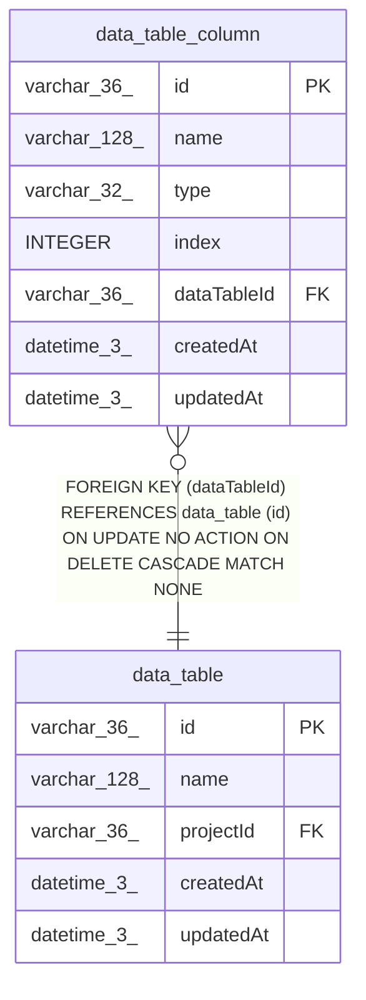

# data_table_column

## Description

<details>
<summary><strong>Table Definition</strong></summary>

```sql
CREATE TABLE "data_table_column" ("id" varchar(36) PRIMARY KEY NOT NULL, "name" varchar(128) NOT NULL, "type" varchar(32) NOT NULL, "index" integer NOT NULL, "dataTableId" varchar(36) NOT NULL, "createdAt" datetime(3) NOT NULL DEFAULT (STRFTIME('%Y-%m-%d %H:%M:%f', 'NOW')), "updatedAt" datetime(3) NOT NULL DEFAULT (STRFTIME('%Y-%m-%d %H:%M:%f', 'NOW')), CONSTRAINT "UQ_8082ec4890f892f0bc77473a123" UNIQUE ("dataTableId", "name"), CONSTRAINT "FK_930b6e8faaf88294cef23484160" FOREIGN KEY ("dataTableId") REFERENCES "data_table" ("id") ON DELETE CASCADE)
```

</details>

## Columns

| Name | Type | Default | Nullable | Children | Parents | Comment |
| ---- | ---- | ------- | -------- | -------- | ------- | ------- |
| id | varchar(36) |  | false |  |  |  |
| name | varchar(128) |  | false |  |  |  |
| type | varchar(32) |  | false |  |  |  |
| index | INTEGER |  | false |  |  |  |
| dataTableId | varchar(36) |  | false |  | [data_table](data_table.md) |  |
| createdAt | datetime(3) | STRFTIME('%Y-%m-%d %H:%M:%f', 'NOW') | false |  |  |  |
| updatedAt | datetime(3) | STRFTIME('%Y-%m-%d %H:%M:%f', 'NOW') | false |  |  |  |

## Constraints

| Name | Type | Definition |
| ---- | ---- | ---------- |
| id | PRIMARY KEY | PRIMARY KEY (id) |
| - (Foreign key ID: 0) | FOREIGN KEY | FOREIGN KEY (dataTableId) REFERENCES data_table (id) ON UPDATE NO ACTION ON DELETE CASCADE MATCH NONE |
| sqlite_autoindex_data_table_column_2 | UNIQUE | UNIQUE (dataTableId, name) |
| sqlite_autoindex_data_table_column_1 | PRIMARY KEY | PRIMARY KEY (id) |

## Indexes

| Name | Definition |
| ---- | ---------- |
| sqlite_autoindex_data_table_column_2 | UNIQUE (dataTableId, name) |
| sqlite_autoindex_data_table_column_1 | PRIMARY KEY (id) |

## Relations



---

> Generated by [tbls](https://github.com/k1LoW/tbls)
