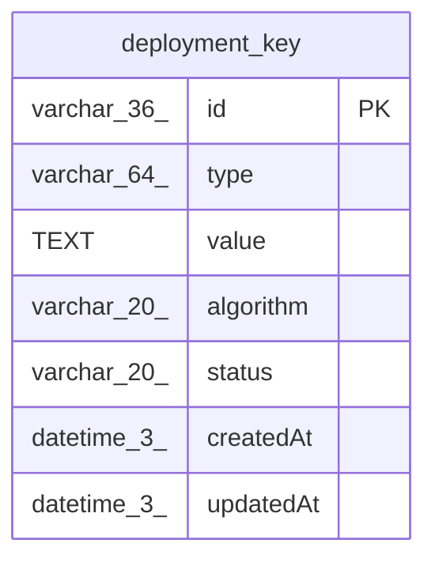

# deployment_key

## Description

<details>
<summary><strong>Table Definition</strong></summary>

```sql
CREATE TABLE "deployment_key" ("id" varchar(36) PRIMARY KEY NOT NULL, "type" varchar(64) NOT NULL, "value" text NOT NULL, "algorithm" varchar(20), "status" varchar(20) NOT NULL, "createdAt" datetime(3) NOT NULL DEFAULT (STRFTIME('%Y-%m-%d %H:%M:%f', 'NOW')), "updatedAt" datetime(3) NOT NULL DEFAULT (STRFTIME('%Y-%m-%d %H:%M:%f', 'NOW')))
```

</details>

## Columns

| Name | Type | Default | Nullable | Children | Parents | Comment |
| ---- | ---- | ------- | -------- | -------- | ------- | ------- |
| id | varchar(36) |  | false |  |  |  |
| type | varchar(64) |  | false |  |  |  |
| value | TEXT |  | false |  |  |  |
| algorithm | varchar(20) |  | true |  |  |  |
| status | varchar(20) |  | false |  |  |  |
| createdAt | datetime(3) | STRFTIME('%Y-%m-%d %H:%M:%f', 'NOW') | false |  |  |  |
| updatedAt | datetime(3) | STRFTIME('%Y-%m-%d %H:%M:%f', 'NOW') | false |  |  |  |

## Constraints

| Name | Type | Definition |
| ---- | ---- | ---------- |
| id | PRIMARY KEY | PRIMARY KEY (id) |
| sqlite_autoindex_deployment_key_1 | PRIMARY KEY | PRIMARY KEY (id) |

## Indexes

| Name | Definition |
| ---- | ---------- |
| IDX_deployment_key_jwe_private_key_active | CREATE UNIQUE INDEX "IDX_deployment_key_jwe_private_key_active" ON "deployment_key" ("type", "algorithm") WHERE status = 'active' AND type = 'jwe.private-key' |
| IDX_deployment_key_signing_binary_data_active | CREATE UNIQUE INDEX "IDX_deployment_key_signing_binary_data_active" ON "deployment_key" ("type") WHERE status = 'active' AND type = 'signing.binary_data' |
| IDX_deployment_key_signing_hmac_active | CREATE UNIQUE INDEX "IDX_deployment_key_signing_hmac_active" ON "deployment_key" ("type") WHERE status = 'active' AND type = 'signing.hmac' |
| IDX_deployment_key_signing_jwt_active | CREATE UNIQUE INDEX "IDX_deployment_key_signing_jwt_active" ON "deployment_key" ("type") WHERE status = 'active' AND type = 'signing.jwt' |
| IDX_deployment_key_instance_id_active | CREATE UNIQUE INDEX "IDX_deployment_key_instance_id_active" ON "deployment_key" ("type") WHERE status = 'active' AND type = 'instance.id' |
| IDX_deployment_key_data_encryption_active | CREATE UNIQUE INDEX "IDX_deployment_key_data_encryption_active" ON "deployment_key" ("type") WHERE status = 'active' AND type = 'data_encryption' |
| sqlite_autoindex_deployment_key_1 | PRIMARY KEY (id) |

## Relations



---

> Generated by [tbls](https://github.com/k1LoW/tbls)
