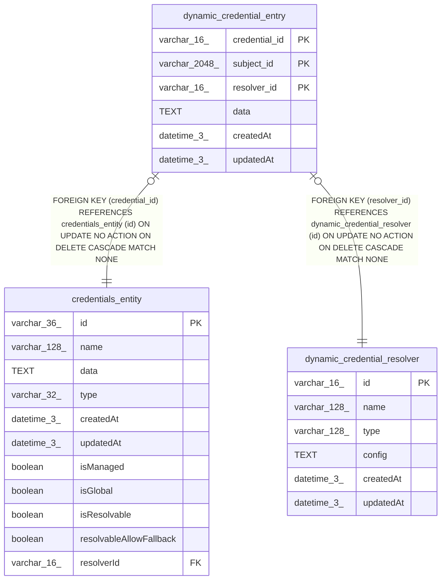

# dynamic_credential_entry

## Description

<details>
<summary><strong>Table Definition</strong></summary>

```sql
CREATE TABLE "dynamic_credential_entry" ("credential_id" varchar(16) NOT NULL, "subject_id" varchar(2048) NOT NULL, "resolver_id" varchar(16) NOT NULL, "data" text NOT NULL, "createdAt" datetime(3) NOT NULL DEFAULT (STRFTIME('%Y-%m-%d %H:%M:%f', 'NOW')), "updatedAt" datetime(3) NOT NULL DEFAULT (STRFTIME('%Y-%m-%d %H:%M:%f', 'NOW')), CONSTRAINT "FK_a6d1dd080958304a47a02952aab" FOREIGN KEY ("credential_id") REFERENCES "credentials_entity" ("id") ON DELETE CASCADE, CONSTRAINT "FK_d61a12235d268a49af6a3c09c13" FOREIGN KEY ("resolver_id") REFERENCES "dynamic_credential_resolver" ("id") ON DELETE CASCADE, PRIMARY KEY ("credential_id", "subject_id", "resolver_id"))
```

</details>

## Columns

| Name | Type | Default | Nullable | Children | Parents | Comment |
| ---- | ---- | ------- | -------- | -------- | ------- | ------- |
| credential_id | varchar(16) |  | false |  | [credentials_entity](credentials_entity.md) |  |
| subject_id | varchar(2048) |  | false |  |  |  |
| resolver_id | varchar(16) |  | false |  | [dynamic_credential_resolver](dynamic_credential_resolver.md) |  |
| data | TEXT |  | false |  |  |  |
| createdAt | datetime(3) | STRFTIME('%Y-%m-%d %H:%M:%f', 'NOW') | false |  |  |  |
| updatedAt | datetime(3) | STRFTIME('%Y-%m-%d %H:%M:%f', 'NOW') | false |  |  |  |

## Constraints

| Name | Type | Definition |
| ---- | ---- | ---------- |
| credential_id | PRIMARY KEY | PRIMARY KEY (credential_id) |
| subject_id | PRIMARY KEY | PRIMARY KEY (subject_id) |
| resolver_id | PRIMARY KEY | PRIMARY KEY (resolver_id) |
| - (Foreign key ID: 0) | FOREIGN KEY | FOREIGN KEY (resolver_id) REFERENCES dynamic_credential_resolver (id) ON UPDATE NO ACTION ON DELETE CASCADE MATCH NONE |
| - (Foreign key ID: 1) | FOREIGN KEY | FOREIGN KEY (credential_id) REFERENCES credentials_entity (id) ON UPDATE NO ACTION ON DELETE CASCADE MATCH NONE |
| sqlite_autoindex_dynamic_credential_entry_1 | PRIMARY KEY | PRIMARY KEY (credential_id, subject_id, resolver_id) |

## Indexes

| Name | Definition |
| ---- | ---------- |
| IDX_d61a12235d268a49af6a3c09c1 | CREATE INDEX "IDX_d61a12235d268a49af6a3c09c1" ON "dynamic_credential_entry" ("resolver_id")  |
| IDX_62476b94b56d9dc7ed9ed75d3d | CREATE INDEX "IDX_62476b94b56d9dc7ed9ed75d3d" ON "dynamic_credential_entry" ("subject_id")  |
| sqlite_autoindex_dynamic_credential_entry_1 | PRIMARY KEY (credential_id, subject_id, resolver_id) |

## Relations



---

> Generated by [tbls](https://github.com/k1LoW/tbls)
