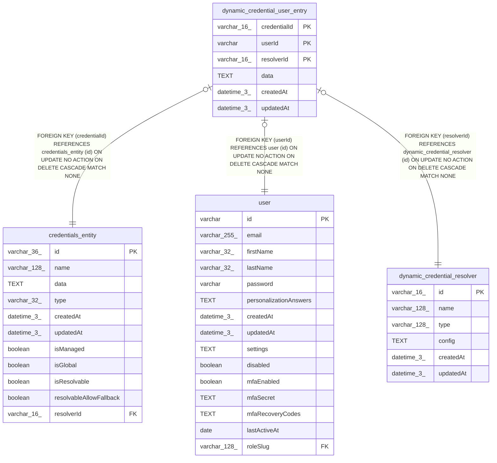

# dynamic_credential_user_entry

## Description

<details>
<summary><strong>Table Definition</strong></summary>

```sql
CREATE TABLE "dynamic_credential_user_entry" ("credentialId" varchar(16) NOT NULL, "userId" varchar NOT NULL, "resolverId" varchar(16) NOT NULL, "data" text NOT NULL, "createdAt" datetime(3) NOT NULL DEFAULT (STRFTIME('%Y-%m-%d %H:%M:%f', 'NOW')), "updatedAt" datetime(3) NOT NULL DEFAULT (STRFTIME('%Y-%m-%d %H:%M:%f', 'NOW')), CONSTRAINT "FK_945ba70b342a066d1306b12ccd2" FOREIGN KEY ("credentialId") REFERENCES "credentials_entity" ("id") ON DELETE CASCADE, CONSTRAINT "FK_6edec973a6450990977bb854c38" FOREIGN KEY ("resolverId") REFERENCES "dynamic_credential_resolver" ("id") ON DELETE CASCADE, CONSTRAINT "FK_a36dc616fabc3f736bb82410a22" FOREIGN KEY ("userId") REFERENCES "user" ("id") ON DELETE CASCADE, PRIMARY KEY ("credentialId", "userId", "resolverId"))
```

</details>

## Columns

| Name | Type | Default | Nullable | Children | Parents | Comment |
| ---- | ---- | ------- | -------- | -------- | ------- | ------- |
| credentialId | varchar(16) |  | false |  | [credentials_entity](credentials_entity.md) |  |
| userId | varchar |  | false |  | [user](user.md) |  |
| resolverId | varchar(16) |  | false |  | [dynamic_credential_resolver](dynamic_credential_resolver.md) |  |
| data | TEXT |  | false |  |  |  |
| createdAt | datetime(3) | STRFTIME('%Y-%m-%d %H:%M:%f', 'NOW') | false |  |  |  |
| updatedAt | datetime(3) | STRFTIME('%Y-%m-%d %H:%M:%f', 'NOW') | false |  |  |  |

## Constraints

| Name | Type | Definition |
| ---- | ---- | ---------- |
| credentialId | PRIMARY KEY | PRIMARY KEY (credentialId) |
| userId | PRIMARY KEY | PRIMARY KEY (userId) |
| resolverId | PRIMARY KEY | PRIMARY KEY (resolverId) |
| - (Foreign key ID: 0) | FOREIGN KEY | FOREIGN KEY (userId) REFERENCES user (id) ON UPDATE NO ACTION ON DELETE CASCADE MATCH NONE |
| - (Foreign key ID: 1) | FOREIGN KEY | FOREIGN KEY (resolverId) REFERENCES dynamic_credential_resolver (id) ON UPDATE NO ACTION ON DELETE CASCADE MATCH NONE |
| - (Foreign key ID: 2) | FOREIGN KEY | FOREIGN KEY (credentialId) REFERENCES credentials_entity (id) ON UPDATE NO ACTION ON DELETE CASCADE MATCH NONE |
| sqlite_autoindex_dynamic_credential_user_entry_1 | PRIMARY KEY | PRIMARY KEY (credentialId, userId, resolverId) |

## Indexes

| Name | Definition |
| ---- | ---------- |
| IDX_6edec973a6450990977bb854c3 | CREATE INDEX "IDX_6edec973a6450990977bb854c3" ON "dynamic_credential_user_entry" ("resolverId")  |
| IDX_a36dc616fabc3f736bb82410a2 | CREATE INDEX "IDX_a36dc616fabc3f736bb82410a2" ON "dynamic_credential_user_entry" ("userId")  |
| sqlite_autoindex_dynamic_credential_user_entry_1 | PRIMARY KEY (credentialId, userId, resolverId) |

## Relations



---

> Generated by [tbls](https://github.com/k1LoW/tbls)
