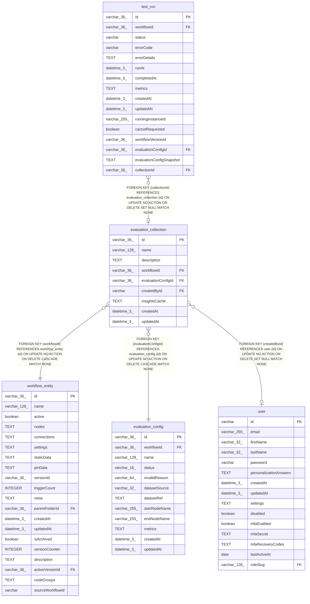

# evaluation_collection

## Description

<details>
<summary><strong>Table Definition</strong></summary>

```sql
CREATE TABLE "evaluation_collection" ("id" varchar(36) PRIMARY KEY NOT NULL, "name" varchar(128) NOT NULL, "description" text, "workflowId" varchar(36) NOT NULL, "evaluationConfigId" varchar(36) NOT NULL, "createdById" varchar, "insightsCache" text, "createdAt" datetime(3) NOT NULL DEFAULT (STRFTIME('%Y-%m-%d %H:%M:%f', 'NOW')), "updatedAt" datetime(3) NOT NULL DEFAULT (STRFTIME('%Y-%m-%d %H:%M:%f', 'NOW')), CONSTRAINT "FK_a48ce930c3bc7604894b8f0eaad" FOREIGN KEY ("workflowId") REFERENCES "workflow_entity" ("id") ON DELETE CASCADE, CONSTRAINT "FK_d634a0c93fd7de68a87eab951b2" FOREIGN KEY ("evaluationConfigId") REFERENCES "evaluation_config" ("id") ON DELETE CASCADE, CONSTRAINT "FK_f4561f38b5a22a4f090d5cd3eae" FOREIGN KEY ("createdById") REFERENCES "user" ("id") ON DELETE SET NULL)
```

</details>

## Columns

| Name | Type | Default | Nullable | Children | Parents | Comment |
| ---- | ---- | ------- | -------- | -------- | ------- | ------- |
| id | varchar(36) |  | false | [test_run](test_run.md) |  |  |
| name | varchar(128) |  | false |  |  |  |
| description | TEXT |  | true |  |  |  |
| workflowId | varchar(36) |  | false |  | [workflow_entity](workflow_entity.md) |  |
| evaluationConfigId | varchar(36) |  | false |  | [evaluation_config](evaluation_config.md) |  |
| createdById | varchar |  | true |  | [user](user.md) |  |
| insightsCache | TEXT |  | true |  |  |  |
| createdAt | datetime(3) | STRFTIME('%Y-%m-%d %H:%M:%f', 'NOW') | false |  |  |  |
| updatedAt | datetime(3) | STRFTIME('%Y-%m-%d %H:%M:%f', 'NOW') | false |  |  |  |

## Constraints

| Name | Type | Definition |
| ---- | ---- | ---------- |
| id | PRIMARY KEY | PRIMARY KEY (id) |
| - (Foreign key ID: 0) | FOREIGN KEY | FOREIGN KEY (createdById) REFERENCES user (id) ON UPDATE NO ACTION ON DELETE SET NULL MATCH NONE |
| - (Foreign key ID: 1) | FOREIGN KEY | FOREIGN KEY (evaluationConfigId) REFERENCES evaluation_config (id) ON UPDATE NO ACTION ON DELETE CASCADE MATCH NONE |
| - (Foreign key ID: 2) | FOREIGN KEY | FOREIGN KEY (workflowId) REFERENCES workflow_entity (id) ON UPDATE NO ACTION ON DELETE CASCADE MATCH NONE |
| sqlite_autoindex_evaluation_collection_1 | PRIMARY KEY | PRIMARY KEY (id) |

## Indexes

| Name | Definition |
| ---- | ---------- |
| IDX_d634a0c93fd7de68a87eab951b | CREATE INDEX "IDX_d634a0c93fd7de68a87eab951b" ON "evaluation_collection" ("evaluationConfigId")  |
| IDX_a48ce930c3bc7604894b8f0eaa | CREATE INDEX "IDX_a48ce930c3bc7604894b8f0eaa" ON "evaluation_collection" ("workflowId")  |
| sqlite_autoindex_evaluation_collection_1 | PRIMARY KEY (id) |

## Relations



---

> Generated by [tbls](https://github.com/k1LoW/tbls)
