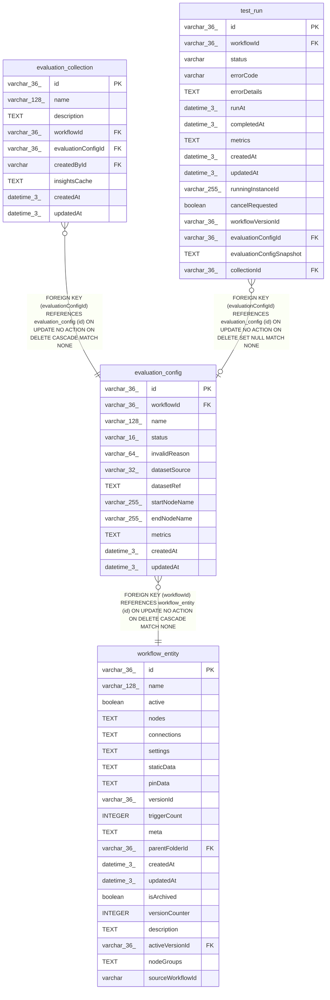

# evaluation_config

## Description

<details>
<summary><strong>Table Definition</strong></summary>

```sql
CREATE TABLE "evaluation_config" ("id" varchar(36) PRIMARY KEY NOT NULL, "workflowId" varchar(36) NOT NULL, "name" varchar(128) NOT NULL, "status" varchar(16) NOT NULL DEFAULT ('valid'), "invalidReason" varchar(64), "datasetSource" varchar(32) NOT NULL, "datasetRef" text NOT NULL, "startNodeName" varchar(255) NOT NULL, "endNodeName" varchar(255) NOT NULL, "metrics" text NOT NULL, "createdAt" datetime(3) NOT NULL DEFAULT (STRFTIME('%Y-%m-%d %H:%M:%f', 'NOW')), "updatedAt" datetime(3) NOT NULL DEFAULT (STRFTIME('%Y-%m-%d %H:%M:%f', 'NOW')), CONSTRAINT "UQ_3c3c99a712e971835c52292e44c" UNIQUE ("workflowId", "name"), CONSTRAINT "FK_fd7542bb123074760285dc1bbf3" FOREIGN KEY ("workflowId") REFERENCES "workflow_entity" ("id") ON DELETE CASCADE)
```

</details>

## Columns

| Name | Type | Default | Nullable | Children | Parents | Comment |
| ---- | ---- | ------- | -------- | -------- | ------- | ------- |
| id | varchar(36) |  | false | [evaluation_collection](evaluation_collection.md) [test_run](test_run.md) |  |  |
| workflowId | varchar(36) |  | false |  | [workflow_entity](workflow_entity.md) |  |
| name | varchar(128) |  | false |  |  |  |
| status | varchar(16) | 'valid' | false |  |  |  |
| invalidReason | varchar(64) |  | true |  |  |  |
| datasetSource | varchar(32) |  | false |  |  |  |
| datasetRef | TEXT |  | false |  |  |  |
| startNodeName | varchar(255) |  | false |  |  |  |
| endNodeName | varchar(255) |  | false |  |  |  |
| metrics | TEXT |  | false |  |  |  |
| createdAt | datetime(3) | STRFTIME('%Y-%m-%d %H:%M:%f', 'NOW') | false |  |  |  |
| updatedAt | datetime(3) | STRFTIME('%Y-%m-%d %H:%M:%f', 'NOW') | false |  |  |  |

## Constraints

| Name | Type | Definition |
| ---- | ---- | ---------- |
| id | PRIMARY KEY | PRIMARY KEY (id) |
| - (Foreign key ID: 0) | FOREIGN KEY | FOREIGN KEY (workflowId) REFERENCES workflow_entity (id) ON UPDATE NO ACTION ON DELETE CASCADE MATCH NONE |
| sqlite_autoindex_evaluation_config_2 | UNIQUE | UNIQUE (workflowId, name) |
| sqlite_autoindex_evaluation_config_1 | PRIMARY KEY | PRIMARY KEY (id) |

## Indexes

| Name | Definition |
| ---- | ---------- |
| IDX_fd7542bb123074760285dc1bbf | CREATE INDEX "IDX_fd7542bb123074760285dc1bbf" ON "evaluation_config" ("workflowId")  |
| sqlite_autoindex_evaluation_config_2 | UNIQUE (workflowId, name) |
| sqlite_autoindex_evaluation_config_1 | PRIMARY KEY (id) |

## Relations



---

> Generated by [tbls](https://github.com/k1LoW/tbls)
