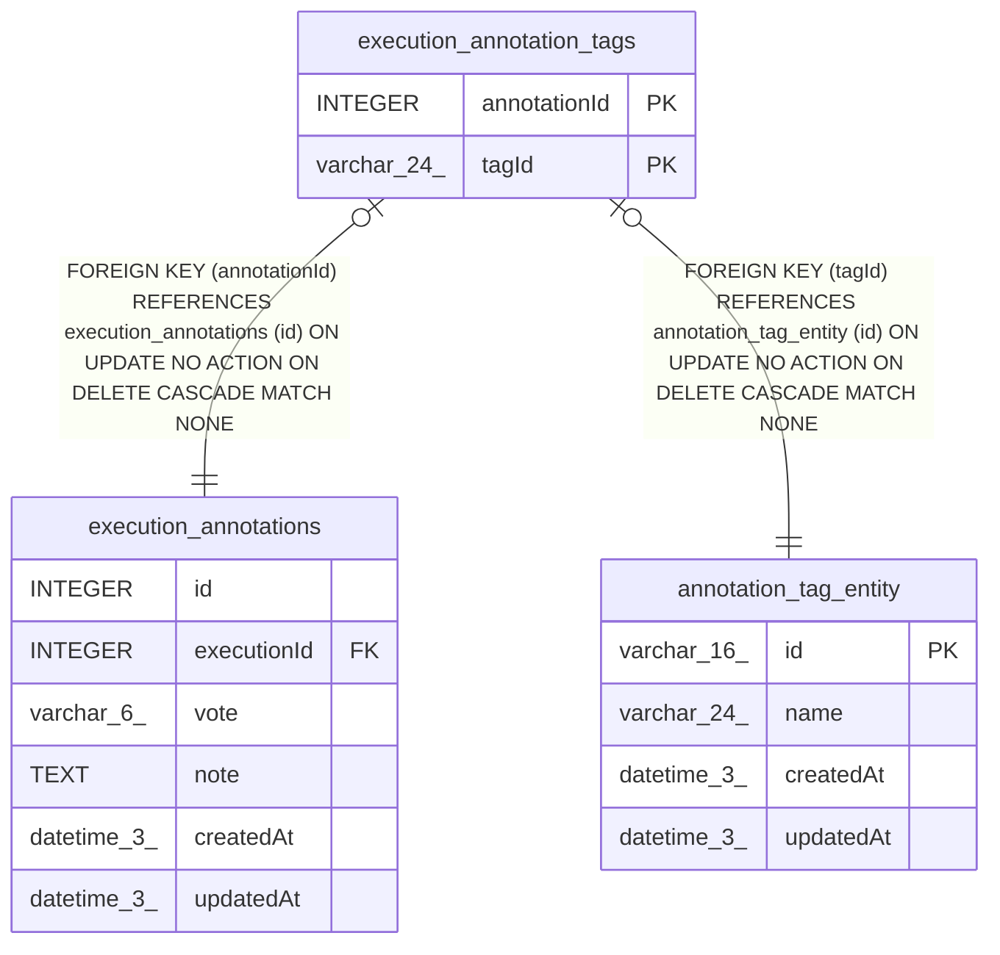

# execution_annotation_tags

## Description

<details>
<summary><strong>Table Definition</strong></summary>

```sql
CREATE TABLE "execution_annotation_tags" ("annotationId" integer NOT NULL, "tagId" varchar(24) NOT NULL, CONSTRAINT "FK_c1519757391996eb06064f0e7c8" FOREIGN KEY ("annotationId") REFERENCES "execution_annotations" ("id") ON DELETE CASCADE, CONSTRAINT "FK_a3697779b366e131b2bbdae2976" FOREIGN KEY ("tagId") REFERENCES "annotation_tag_entity" ("id") ON DELETE CASCADE, PRIMARY KEY ("annotationId", "tagId"))
```

</details>

## Columns

| Name | Type | Default | Nullable | Children | Parents | Comment |
| ---- | ---- | ------- | -------- | -------- | ------- | ------- |
| annotationId | INTEGER |  | false |  | [execution_annotations](execution_annotations.md) |  |
| tagId | varchar(24) |  | false |  | [annotation_tag_entity](annotation_tag_entity.md) |  |

## Constraints

| Name | Type | Definition |
| ---- | ---- | ---------- |
| annotationId | PRIMARY KEY | PRIMARY KEY (annotationId) |
| tagId | PRIMARY KEY | PRIMARY KEY (tagId) |
| - (Foreign key ID: 0) | FOREIGN KEY | FOREIGN KEY (tagId) REFERENCES annotation_tag_entity (id) ON UPDATE NO ACTION ON DELETE CASCADE MATCH NONE |
| - (Foreign key ID: 1) | FOREIGN KEY | FOREIGN KEY (annotationId) REFERENCES execution_annotations (id) ON UPDATE NO ACTION ON DELETE CASCADE MATCH NONE |
| sqlite_autoindex_execution_annotation_tags_1 | PRIMARY KEY | PRIMARY KEY (annotationId, tagId) |

## Indexes

| Name | Definition |
| ---- | ---------- |
| IDX_c1519757391996eb06064f0e7c | CREATE INDEX "IDX_c1519757391996eb06064f0e7c" ON "execution_annotation_tags" ("annotationId")  |
| IDX_a3697779b366e131b2bbdae297 | CREATE INDEX "IDX_a3697779b366e131b2bbdae297" ON "execution_annotation_tags" ("tagId")  |
| sqlite_autoindex_execution_annotation_tags_1 | PRIMARY KEY (annotationId, tagId) |

## Relations



---

> Generated by [tbls](https://github.com/k1LoW/tbls)
