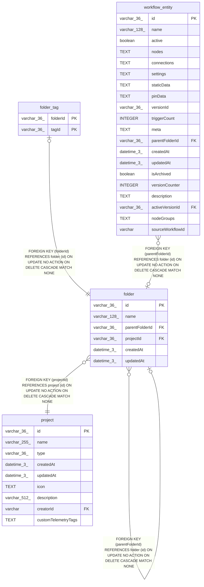

# folder

## Description

<details>
<summary><strong>Table Definition</strong></summary>

```sql
CREATE TABLE "folder" ("id" varchar(36) PRIMARY KEY NOT NULL, "name" varchar(128) NOT NULL, "parentFolderId" varchar(36), "projectId" varchar(36) NOT NULL, "createdAt" datetime(3) NOT NULL DEFAULT (STRFTIME('%Y-%m-%d %H:%M:%f', 'NOW')), "updatedAt" datetime(3) NOT NULL DEFAULT (STRFTIME('%Y-%m-%d %H:%M:%f', 'NOW')), CONSTRAINT "FK_a8260b0b36939c6247f385b8221" FOREIGN KEY ("projectId") REFERENCES "project" ("id") ON DELETE CASCADE, CONSTRAINT "FK_804ea52f6729e3940498bd54d78" FOREIGN KEY ("parentFolderId") REFERENCES "folder" ("id") ON DELETE CASCADE)
```

</details>

## Columns

| Name | Type | Default | Nullable | Children | Parents | Comment |
| ---- | ---- | ------- | -------- | -------- | ------- | ------- |
| id | varchar(36) |  | false | [folder](folder.md) [folder_tag](folder_tag.md) [workflow_entity](workflow_entity.md) |  |  |
| name | varchar(128) |  | false |  |  |  |
| parentFolderId | varchar(36) |  | true |  | [folder](folder.md) |  |
| projectId | varchar(36) |  | false |  | [project](project.md) |  |
| createdAt | datetime(3) | STRFTIME('%Y-%m-%d %H:%M:%f', 'NOW') | false |  |  |  |
| updatedAt | datetime(3) | STRFTIME('%Y-%m-%d %H:%M:%f', 'NOW') | false |  |  |  |

## Constraints

| Name | Type | Definition |
| ---- | ---- | ---------- |
| id | PRIMARY KEY | PRIMARY KEY (id) |
| - (Foreign key ID: 0) | FOREIGN KEY | FOREIGN KEY (parentFolderId) REFERENCES folder (id) ON UPDATE NO ACTION ON DELETE CASCADE MATCH NONE |
| - (Foreign key ID: 1) | FOREIGN KEY | FOREIGN KEY (projectId) REFERENCES project (id) ON UPDATE NO ACTION ON DELETE CASCADE MATCH NONE |
| sqlite_autoindex_folder_1 | PRIMARY KEY | PRIMARY KEY (id) |

## Indexes

| Name | Definition |
| ---- | ---------- |
| IDX_14f68deffaf858465715995508 | CREATE UNIQUE INDEX "IDX_14f68deffaf858465715995508" ON "folder" ("projectId", "id")  |
| sqlite_autoindex_folder_1 | PRIMARY KEY (id) |

## Relations



---

> Generated by [tbls](https://github.com/k1LoW/tbls)
