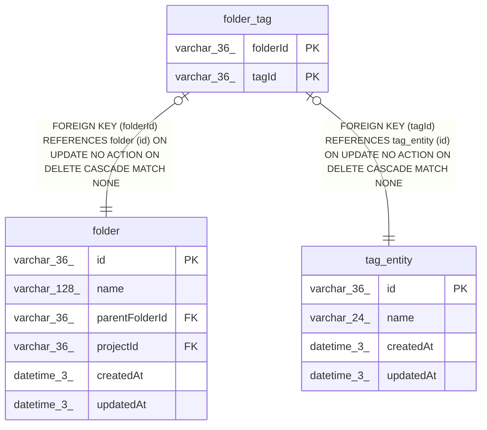

# folder_tag

## Description

<details>
<summary><strong>Table Definition</strong></summary>

```sql
CREATE TABLE "folder_tag" ("folderId" varchar(36) NOT NULL, "tagId" varchar(36) NOT NULL, CONSTRAINT "FK_94a60854e06f2897b2e0d39edba" FOREIGN KEY ("folderId") REFERENCES "folder" ("id") ON DELETE CASCADE, CONSTRAINT "FK_dc88164176283de80af47621746" FOREIGN KEY ("tagId") REFERENCES "tag_entity" ("id") ON DELETE CASCADE, PRIMARY KEY ("folderId", "tagId"))
```

</details>

## Columns

| Name | Type | Default | Nullable | Children | Parents | Comment |
| ---- | ---- | ------- | -------- | -------- | ------- | ------- |
| folderId | varchar(36) |  | false |  | [folder](folder.md) |  |
| tagId | varchar(36) |  | false |  | [tag_entity](tag_entity.md) |  |

## Constraints

| Name | Type | Definition |
| ---- | ---- | ---------- |
| folderId | PRIMARY KEY | PRIMARY KEY (folderId) |
| tagId | PRIMARY KEY | PRIMARY KEY (tagId) |
| - (Foreign key ID: 0) | FOREIGN KEY | FOREIGN KEY (tagId) REFERENCES tag_entity (id) ON UPDATE NO ACTION ON DELETE CASCADE MATCH NONE |
| - (Foreign key ID: 1) | FOREIGN KEY | FOREIGN KEY (folderId) REFERENCES folder (id) ON UPDATE NO ACTION ON DELETE CASCADE MATCH NONE |
| sqlite_autoindex_folder_tag_1 | PRIMARY KEY | PRIMARY KEY (folderId, tagId) |

## Indexes

| Name | Definition |
| ---- | ---------- |
| sqlite_autoindex_folder_tag_1 | PRIMARY KEY (folderId, tagId) |

## Relations



---

> Generated by [tbls](https://github.com/k1LoW/tbls)
