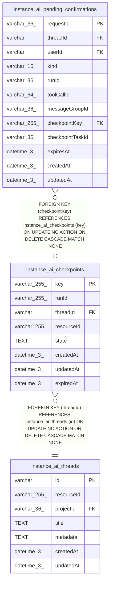

# instance_ai_checkpoints

## Description

<details>
<summary><strong>Table Definition</strong></summary>

```sql
CREATE TABLE "instance_ai_checkpoints" ("key" varchar(255) PRIMARY KEY NOT NULL, "runId" varchar(255), "threadId" varchar NOT NULL, "resourceId" varchar(255), "state" text, "createdAt" datetime(3) NOT NULL DEFAULT (STRFTIME('%Y-%m-%d %H:%M:%f', 'NOW')), "updatedAt" datetime(3) NOT NULL DEFAULT (STRFTIME('%Y-%m-%d %H:%M:%f', 'NOW')), "expiredAt" datetime(3), CONSTRAINT "instance_ai_checkpoints_state_tombstone_check" CHECK (("expiredAt" IS NOT NULL AND "state" IS NULL) OR "expiredAt" IS NULL), CONSTRAINT "FK_2b23f3f24a70bebb990203b011e" FOREIGN KEY ("threadId") REFERENCES "instance_ai_threads" ("id") ON DELETE CASCADE ON UPDATE NO ACTION)
```

</details>

## Columns

| Name | Type | Default | Nullable | Children | Parents | Comment |
| ---- | ---- | ------- | -------- | -------- | ------- | ------- |
| key | varchar(255) |  | false | [instance_ai_pending_confirmations](instance_ai_pending_confirmations.md) |  |  |
| runId | varchar(255) |  | true |  |  |  |
| threadId | varchar |  | false |  | [instance_ai_threads](instance_ai_threads.md) |  |
| resourceId | varchar(255) |  | true |  |  |  |
| state | TEXT |  | true |  |  |  |
| createdAt | datetime(3) | STRFTIME('%Y-%m-%d %H:%M:%f', 'NOW') | false |  |  |  |
| updatedAt | datetime(3) | STRFTIME('%Y-%m-%d %H:%M:%f', 'NOW') | false |  |  |  |
| expiredAt | datetime(3) |  | true |  |  |  |

## Constraints

| Name | Type | Definition |
| ---- | ---- | ---------- |
| key | PRIMARY KEY | PRIMARY KEY (key) |
| - (Foreign key ID: 0) | FOREIGN KEY | FOREIGN KEY (threadId) REFERENCES instance_ai_threads (id) ON UPDATE NO ACTION ON DELETE CASCADE MATCH NONE |
| sqlite_autoindex_instance_ai_checkpoints_1 | PRIMARY KEY | PRIMARY KEY (key) |
| - | CHECK | CHECK (("expiredAt" IS NOT NULL AND "state" IS NULL) OR "expiredAt" IS NULL) |

## Indexes

| Name | Definition |
| ---- | ---------- |
| IDX_be9d0eca0b19fb93d4eb74b327 | CREATE INDEX "IDX_be9d0eca0b19fb93d4eb74b327" ON "instance_ai_checkpoints" ("resourceId")  |
| IDX_2b23f3f24a70bebb990203b011 | CREATE INDEX "IDX_2b23f3f24a70bebb990203b011" ON "instance_ai_checkpoints" ("threadId")  |
| IDX_768189b506cc26c4fe878b87cb | CREATE INDEX "IDX_768189b506cc26c4fe878b87cb" ON "instance_ai_checkpoints" ("runId")  |
| sqlite_autoindex_instance_ai_checkpoints_1 | PRIMARY KEY (key) |

## Relations



---

> Generated by [tbls](https://github.com/k1LoW/tbls)
