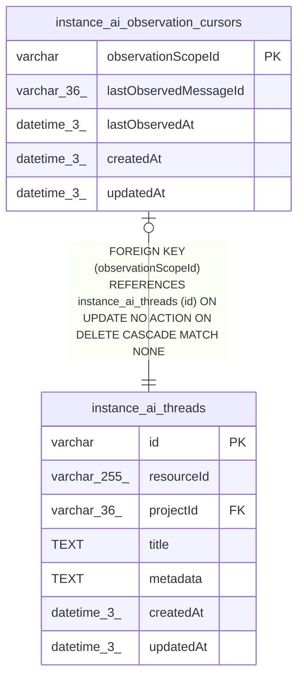

# instance_ai_observation_cursors

## Description

<details>
<summary><strong>Table Definition</strong></summary>

```sql
CREATE TABLE "instance_ai_observation_cursors" ("observationScopeId" varchar PRIMARY KEY NOT NULL, "lastObservedMessageId" varchar(36) NOT NULL, "lastObservedAt" datetime(3) NOT NULL, "createdAt" datetime(3) NOT NULL DEFAULT (STRFTIME('%Y-%m-%d %H:%M:%f', 'NOW')), "updatedAt" datetime(3) NOT NULL DEFAULT (STRFTIME('%Y-%m-%d %H:%M:%f', 'NOW')), CONSTRAINT "FK_5b6319b2e9a37c1064a72428f9a" FOREIGN KEY ("observationScopeId") REFERENCES "instance_ai_threads" ("id") ON DELETE CASCADE)
```

</details>

## Columns

| Name | Type | Default | Nullable | Children | Parents | Comment |
| ---- | ---- | ------- | -------- | -------- | ------- | ------- |
| observationScopeId | varchar |  | false |  | [instance_ai_threads](instance_ai_threads.md) |  |
| lastObservedMessageId | varchar(36) |  | false |  |  |  |
| lastObservedAt | datetime(3) |  | false |  |  |  |
| createdAt | datetime(3) | STRFTIME('%Y-%m-%d %H:%M:%f', 'NOW') | false |  |  |  |
| updatedAt | datetime(3) | STRFTIME('%Y-%m-%d %H:%M:%f', 'NOW') | false |  |  |  |

## Constraints

| Name | Type | Definition |
| ---- | ---- | ---------- |
| observationScopeId | PRIMARY KEY | PRIMARY KEY (observationScopeId) |
| - (Foreign key ID: 0) | FOREIGN KEY | FOREIGN KEY (observationScopeId) REFERENCES instance_ai_threads (id) ON UPDATE NO ACTION ON DELETE CASCADE MATCH NONE |
| sqlite_autoindex_instance_ai_observation_cursors_1 | PRIMARY KEY | PRIMARY KEY (observationScopeId) |

## Indexes

| Name | Definition |
| ---- | ---------- |
| sqlite_autoindex_instance_ai_observation_cursors_1 | PRIMARY KEY (observationScopeId) |

## Relations



---

> Generated by [tbls](https://github.com/k1LoW/tbls)
