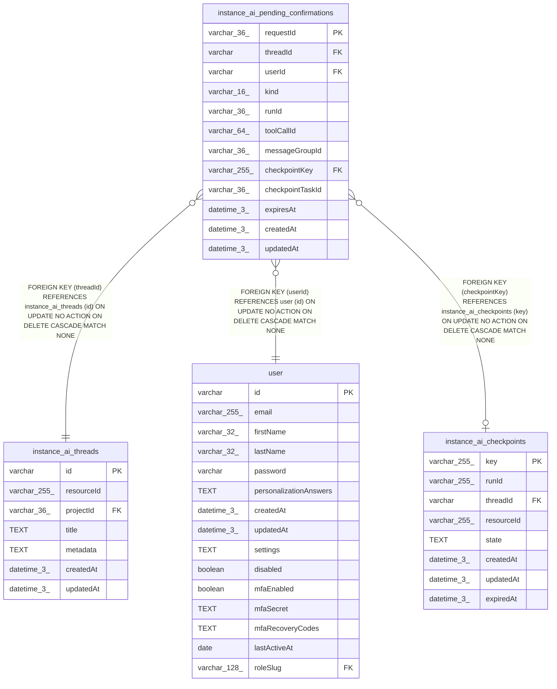

# instance_ai_pending_confirmations

## Description

<details>
<summary><strong>Table Definition</strong></summary>

```sql
CREATE TABLE "instance_ai_pending_confirmations" ("requestId" varchar(36) PRIMARY KEY NOT NULL, "threadId" varchar NOT NULL, "userId" varchar NOT NULL, "kind" varchar(16) NOT NULL, "runId" varchar(36) NOT NULL, "toolCallId" varchar(64), "messageGroupId" varchar(36), "checkpointKey" varchar(255), "checkpointTaskId" varchar(36), "expiresAt" datetime(3), "createdAt" datetime(3) NOT NULL DEFAULT (STRFTIME('%Y-%m-%d %H:%M:%f', 'NOW')), "updatedAt" datetime(3) NOT NULL DEFAULT (STRFTIME('%Y-%m-%d %H:%M:%f', 'NOW')), CONSTRAINT "CHK_instance_ai_pending_confirmations_kind" CHECK ("kind" IN ('suspended', 'inline')), CONSTRAINT "FK_ba67ee8dc311830a2eea89b6e96" FOREIGN KEY ("threadId") REFERENCES "instance_ai_threads" ("id") ON DELETE CASCADE, CONSTRAINT "FK_df5fd25c8bbfd2b042602600d8e" FOREIGN KEY ("userId") REFERENCES "user" ("id") ON DELETE CASCADE, CONSTRAINT "FK_0babdf6e3b897a86fe4678355eb" FOREIGN KEY ("checkpointKey") REFERENCES "instance_ai_checkpoints" ("key") ON DELETE CASCADE)
```

</details>

## Columns

| Name | Type | Default | Nullable | Children | Parents | Comment |
| ---- | ---- | ------- | -------- | -------- | ------- | ------- |
| requestId | varchar(36) |  | false |  |  |  |
| threadId | varchar |  | false |  | [instance_ai_threads](instance_ai_threads.md) |  |
| userId | varchar |  | false |  | [user](user.md) |  |
| kind | varchar(16) |  | false |  |  |  |
| runId | varchar(36) |  | false |  |  |  |
| toolCallId | varchar(64) |  | true |  |  |  |
| messageGroupId | varchar(36) |  | true |  |  |  |
| checkpointKey | varchar(255) |  | true |  | [instance_ai_checkpoints](instance_ai_checkpoints.md) |  |
| checkpointTaskId | varchar(36) |  | true |  |  |  |
| expiresAt | datetime(3) |  | true |  |  |  |
| createdAt | datetime(3) | STRFTIME('%Y-%m-%d %H:%M:%f', 'NOW') | false |  |  |  |
| updatedAt | datetime(3) | STRFTIME('%Y-%m-%d %H:%M:%f', 'NOW') | false |  |  |  |

## Constraints

| Name | Type | Definition |
| ---- | ---- | ---------- |
| requestId | PRIMARY KEY | PRIMARY KEY (requestId) |
| - (Foreign key ID: 0) | FOREIGN KEY | FOREIGN KEY (checkpointKey) REFERENCES instance_ai_checkpoints (key) ON UPDATE NO ACTION ON DELETE CASCADE MATCH NONE |
| - (Foreign key ID: 1) | FOREIGN KEY | FOREIGN KEY (userId) REFERENCES user (id) ON UPDATE NO ACTION ON DELETE CASCADE MATCH NONE |
| - (Foreign key ID: 2) | FOREIGN KEY | FOREIGN KEY (threadId) REFERENCES instance_ai_threads (id) ON UPDATE NO ACTION ON DELETE CASCADE MATCH NONE |
| sqlite_autoindex_instance_ai_pending_confirmations_1 | PRIMARY KEY | PRIMARY KEY (requestId) |
| - | CHECK | CHECK ("kind" IN ('suspended', 'inline')) |

## Indexes

| Name | Definition |
| ---- | ---------- |
| IDX_d7a4aba7440449865e2b924377 | CREATE INDEX "IDX_d7a4aba7440449865e2b924377" ON "instance_ai_pending_confirmations" ("expiresAt")  |
| IDX_0babdf6e3b897a86fe4678355e | CREATE INDEX "IDX_0babdf6e3b897a86fe4678355e" ON "instance_ai_pending_confirmations" ("checkpointKey")  |
| IDX_df5fd25c8bbfd2b042602600d8 | CREATE INDEX "IDX_df5fd25c8bbfd2b042602600d8" ON "instance_ai_pending_confirmations" ("userId")  |
| IDX_ba67ee8dc311830a2eea89b6e9 | CREATE INDEX "IDX_ba67ee8dc311830a2eea89b6e9" ON "instance_ai_pending_confirmations" ("threadId")  |
| sqlite_autoindex_instance_ai_pending_confirmations_1 | PRIMARY KEY (requestId) |

## Relations



---

> Generated by [tbls](https://github.com/k1LoW/tbls)
