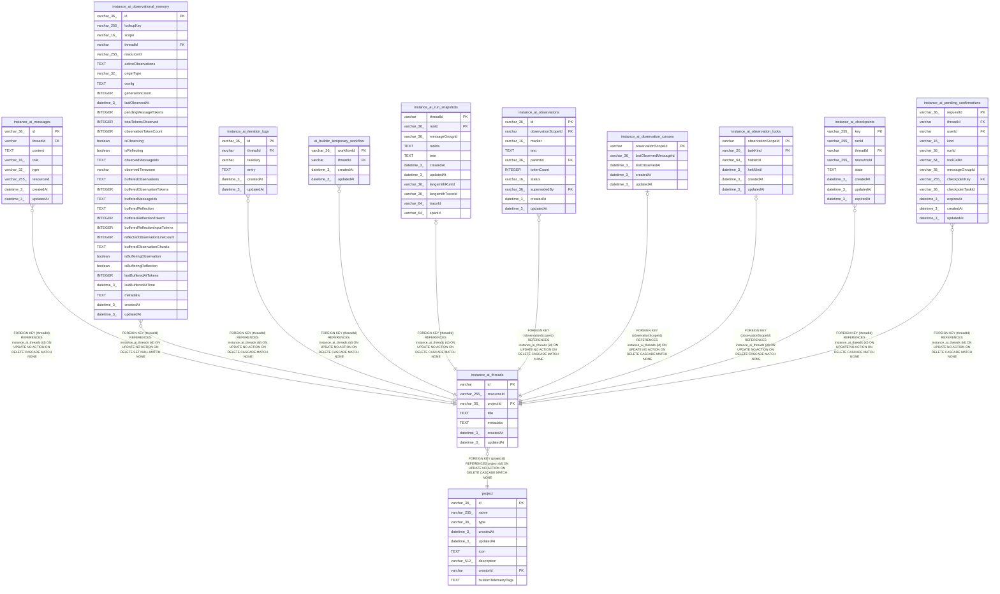

# instance_ai_threads

## Description

<details>
<summary><strong>Table Definition</strong></summary>

```sql
CREATE TABLE "instance_ai_threads" ("id" varchar PRIMARY KEY NOT NULL, "resourceId" varchar(255) NOT NULL, "projectId" varchar(36) NOT NULL, "title" text NOT NULL DEFAULT (''), "metadata" text, "createdAt" datetime(3) NOT NULL DEFAULT (STRFTIME('%Y-%m-%d %H:%M:%f', 'NOW')), "updatedAt" datetime(3) NOT NULL DEFAULT (STRFTIME('%Y-%m-%d %H:%M:%f', 'NOW')), CONSTRAINT "FK_instance_ai_threads_projectId" FOREIGN KEY ("projectId") REFERENCES "project" ("id") ON DELETE CASCADE)
```

</details>

## Columns

| Name | Type | Default | Nullable | Children | Parents | Comment |
| ---- | ---- | ------- | -------- | -------- | ------- | ------- |
| id | varchar |  | false | [instance_ai_messages](instance_ai_messages.md) [instance_ai_observational_memory](instance_ai_observational_memory.md) [instance_ai_iteration_logs](instance_ai_iteration_logs.md) [ai_builder_temporary_workflow](ai_builder_temporary_workflow.md) [instance_ai_run_snapshots](instance_ai_run_snapshots.md) [instance_ai_observations](instance_ai_observations.md) [instance_ai_observation_cursors](instance_ai_observation_cursors.md) [instance_ai_observation_locks](instance_ai_observation_locks.md) [instance_ai_checkpoints](instance_ai_checkpoints.md) [instance_ai_pending_confirmations](instance_ai_pending_confirmations.md) |  |  |
| resourceId | varchar(255) |  | false |  |  |  |
| projectId | varchar(36) |  | false |  | [project](project.md) |  |
| title | TEXT | '' | false |  |  |  |
| metadata | TEXT |  | true |  |  |  |
| createdAt | datetime(3) | STRFTIME('%Y-%m-%d %H:%M:%f', 'NOW') | false |  |  |  |
| updatedAt | datetime(3) | STRFTIME('%Y-%m-%d %H:%M:%f', 'NOW') | false |  |  |  |

## Constraints

| Name | Type | Definition |
| ---- | ---- | ---------- |
| id | PRIMARY KEY | PRIMARY KEY (id) |
| - (Foreign key ID: 0) | FOREIGN KEY | FOREIGN KEY (projectId) REFERENCES project (id) ON UPDATE NO ACTION ON DELETE CASCADE MATCH NONE |
| sqlite_autoindex_instance_ai_threads_1 | PRIMARY KEY | PRIMARY KEY (id) |

## Indexes

| Name | Definition |
| ---- | ---------- |
| IDX_instance_ai_threads_projectId | CREATE INDEX "IDX_instance_ai_threads_projectId" ON "instance_ai_threads" ("projectId")  |
| IDX_instance_ai_threads_resourceId | CREATE INDEX "IDX_instance_ai_threads_resourceId" ON "instance_ai_threads" ("resourceId")  |
| sqlite_autoindex_instance_ai_threads_1 | PRIMARY KEY (id) |

## Relations



---

> Generated by [tbls](https://github.com/k1LoW/tbls)
