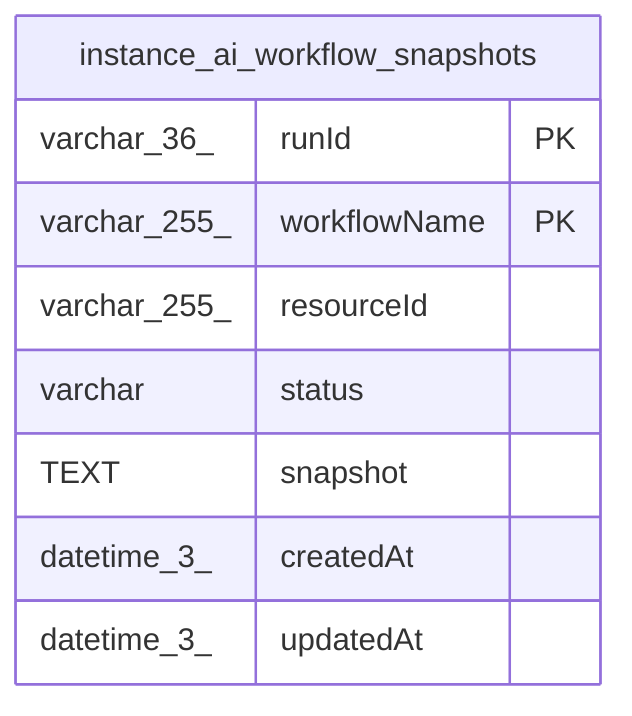

# instance_ai_workflow_snapshots

## Description

<details>
<summary><strong>Table Definition</strong></summary>

```sql
CREATE TABLE "instance_ai_workflow_snapshots" ("runId" varchar(36) NOT NULL, "workflowName" varchar(255) NOT NULL, "resourceId" varchar(255), "status" varchar, "snapshot" text NOT NULL, "createdAt" datetime(3) NOT NULL DEFAULT (STRFTIME('%Y-%m-%d %H:%M:%f', 'NOW')), "updatedAt" datetime(3) NOT NULL DEFAULT (STRFTIME('%Y-%m-%d %H:%M:%f', 'NOW')), PRIMARY KEY ("runId", "workflowName"))
```

</details>

## Columns

| Name | Type | Default | Nullable | Children | Parents | Comment |
| ---- | ---- | ------- | -------- | -------- | ------- | ------- |
| runId | varchar(36) |  | false |  |  |  |
| workflowName | varchar(255) |  | false |  |  |  |
| resourceId | varchar(255) |  | true |  |  |  |
| status | varchar |  | true |  |  |  |
| snapshot | TEXT |  | false |  |  |  |
| createdAt | datetime(3) | STRFTIME('%Y-%m-%d %H:%M:%f', 'NOW') | false |  |  |  |
| updatedAt | datetime(3) | STRFTIME('%Y-%m-%d %H:%M:%f', 'NOW') | false |  |  |  |

## Constraints

| Name | Type | Definition |
| ---- | ---- | ---------- |
| runId | PRIMARY KEY | PRIMARY KEY (runId) |
| workflowName | PRIMARY KEY | PRIMARY KEY (workflowName) |
| sqlite_autoindex_instance_ai_workflow_snapshots_1 | PRIMARY KEY | PRIMARY KEY (runId, workflowName) |

## Indexes

| Name | Definition |
| ---- | ---------- |
| IDX_a371ee6b8e0ebb5635f8baa46d | CREATE INDEX "IDX_a371ee6b8e0ebb5635f8baa46d" ON "instance_ai_workflow_snapshots" ("workflowName", "status")  |
| sqlite_autoindex_instance_ai_workflow_snapshots_1 | PRIMARY KEY (runId, workflowName) |

## Relations



---

> Generated by [tbls](https://github.com/k1LoW/tbls)
