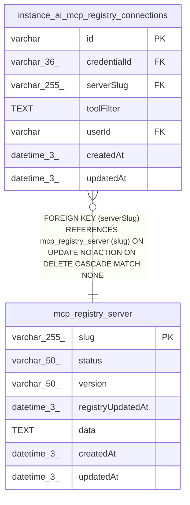

# mcp_registry_server

## Description

<details>
<summary><strong>Table Definition</strong></summary>

```sql
CREATE TABLE "mcp_registry_server" ("slug" varchar(255) PRIMARY KEY NOT NULL, "status" varchar(50) NOT NULL, "version" varchar(50) NOT NULL, "registryUpdatedAt" datetime(3) NOT NULL, "data" text NOT NULL DEFAULT ('{}'), "createdAt" datetime(3) NOT NULL DEFAULT (STRFTIME('%Y-%m-%d %H:%M:%f', 'NOW')), "updatedAt" datetime(3) NOT NULL DEFAULT (STRFTIME('%Y-%m-%d %H:%M:%f', 'NOW')), CONSTRAINT "CHK_tmp_mcp_registry_server_status" CHECK ("status" IN ('active', 'deprecated')))
```

</details>

## Columns

| Name | Type | Default | Nullable | Children | Parents | Comment |
| ---- | ---- | ------- | -------- | -------- | ------- | ------- |
| slug | varchar(255) |  | false | [instance_ai_mcp_registry_connections](instance_ai_mcp_registry_connections.md) |  |  |
| status | varchar(50) |  | false |  |  |  |
| version | varchar(50) |  | false |  |  |  |
| registryUpdatedAt | datetime(3) |  | false |  |  |  |
| data | TEXT | '{}' | false |  |  |  |
| createdAt | datetime(3) | STRFTIME('%Y-%m-%d %H:%M:%f', 'NOW') | false |  |  |  |
| updatedAt | datetime(3) | STRFTIME('%Y-%m-%d %H:%M:%f', 'NOW') | false |  |  |  |

## Constraints

| Name | Type | Definition |
| ---- | ---- | ---------- |
| slug | PRIMARY KEY | PRIMARY KEY (slug) |
| sqlite_autoindex_mcp_registry_server_1 | PRIMARY KEY | PRIMARY KEY (slug) |
| - | CHECK | CHECK ("status" IN ('active', 'deprecated')) |

## Indexes

| Name | Definition |
| ---- | ---------- |
| sqlite_autoindex_mcp_registry_server_1 | PRIMARY KEY (slug) |

## Relations



---

> Generated by [tbls](https://github.com/k1LoW/tbls)
