# project

## Description

<details>
<summary><strong>Table Definition</strong></summary>

```sql
CREATE TABLE "project" ("id" varchar(36) PRIMARY KEY NOT NULL, "name" varchar(255) NOT NULL, "type" varchar(36) NOT NULL, "createdAt" datetime(3) NOT NULL DEFAULT (STRFTIME('%Y-%m-%d %H:%M:%f', 'NOW')), "updatedAt" datetime(3) NOT NULL DEFAULT (STRFTIME('%Y-%m-%d %H:%M:%f', 'NOW')), "icon" text, "description" varchar(512), "creatorId" varchar, "customTelemetryTags" text NOT NULL DEFAULT ('[]'), CONSTRAINT "projects_creatorId_foreign" FOREIGN KEY ("creatorId") REFERENCES "user" ("id") ON DELETE SET NULL ON UPDATE NO ACTION)
```

</details>

## Columns

| Name | Type | Default | Nullable | Children | Parents | Comment |
| ---- | ---- | ------- | -------- | -------- | ------- | ------- |
| id | varchar(36) |  | false | [shared_credentials](shared_credentials.md) [shared_workflow](shared_workflow.md) [folder](folder.md) [insights_metadata](insights_metadata.md) [project_relation](project_relation.md) [data_table](data_table.md) [variables](variables.md) [project_secrets_provider_access](project_secrets_provider_access.md) [role_mapping_rule_project](role_mapping_rule_project.md) [agents](agents.md) [agent_execution_threads](agent_execution_threads.md) [instance_ai_threads](instance_ai_threads.md) |  |  |
| name | varchar(255) |  | false |  |  |  |
| type | varchar(36) |  | false |  |  |  |
| createdAt | datetime(3) | STRFTIME('%Y-%m-%d %H:%M:%f', 'NOW') | false |  |  |  |
| updatedAt | datetime(3) | STRFTIME('%Y-%m-%d %H:%M:%f', 'NOW') | false |  |  |  |
| icon | TEXT |  | true |  |  |  |
| description | varchar(512) |  | true |  |  |  |
| creatorId | varchar |  | true |  | [user](user.md) |  |
| customTelemetryTags | TEXT | '[]' | false |  |  |  |

## Constraints

| Name | Type | Definition |
| ---- | ---- | ---------- |
| id | PRIMARY KEY | PRIMARY KEY (id) |
| - (Foreign key ID: 0) | FOREIGN KEY | FOREIGN KEY (creatorId) REFERENCES user (id) ON UPDATE NO ACTION ON DELETE SET NULL MATCH NONE |
| sqlite_autoindex_project_1 | PRIMARY KEY | PRIMARY KEY (id) |

## Indexes

| Name | Definition |
| ---- | ---------- |
| sqlite_autoindex_project_1 | PRIMARY KEY (id) |

## Relations

```mermaid
erDiagram

"shared_credentials" |o--|| "project" : "FOREIGN KEY (projectId) REFERENCES project (id) ON UPDATE NO ACTION ON DELETE CASCADE MATCH NONE"
"shared_workflow" |o--|| "project" : "FOREIGN KEY (projectId) REFERENCES project (id) ON UPDATE NO ACTION ON DELETE CASCADE MATCH NONE"
"folder" }o--|| "project" : "FOREIGN KEY (projectId) REFERENCES project (id) ON UPDATE NO ACTION ON DELETE CASCADE MATCH NONE"
"insights_metadata" }o--o| "project" : "FOREIGN KEY (projectId) REFERENCES project (id) ON UPDATE NO ACTION ON DELETE SET NULL MATCH NONE"
"project_relation" |o--|| "project" : "FOREIGN KEY (projectId) REFERENCES project (id) ON UPDATE NO ACTION ON DELETE CASCADE MATCH NONE"
"data_table" }o--|| "project" : "FOREIGN KEY (projectId) REFERENCES project (id) ON UPDATE NO ACTION ON DELETE CASCADE MATCH NONE"
"variables" }o--o| "project" : "FOREIGN KEY (projectId) REFERENCES project (id) ON UPDATE NO ACTION ON DELETE CASCADE MATCH NONE"
"project_secrets_provider_access" |o--|| "project" : "FOREIGN KEY (projectId) REFERENCES project (id) ON UPDATE NO ACTION ON DELETE CASCADE MATCH NONE"
"role_mapping_rule_project" |o--|| "project" : "FOREIGN KEY (projectId) REFERENCES project (id) ON UPDATE NO ACTION ON DELETE CASCADE MATCH NONE"
"agents" }o--|| "project" : "FOREIGN KEY (projectId) REFERENCES project (id) ON UPDATE NO ACTION ON DELETE CASCADE MATCH NONE"
"agent_execution_threads" }o--|| "project" : "FOREIGN KEY (projectId) REFERENCES project (id) ON UPDATE NO ACTION ON DELETE CASCADE MATCH NONE"
"instance_ai_threads" }o--|| "project" : "FOREIGN KEY (projectId) REFERENCES project (id) ON UPDATE NO ACTION ON DELETE CASCADE MATCH NONE"
"project" }o--o| "user" : "FOREIGN KEY (creatorId) REFERENCES user (id) ON UPDATE NO ACTION ON DELETE SET NULL MATCH NONE"

"project" {
  varchar_36_ id PK
  varchar_255_ name
  varchar_36_ type
  datetime_3_ createdAt
  datetime_3_ updatedAt
  TEXT icon
  varchar_512_ description
  varchar creatorId FK
  TEXT customTelemetryTags
}
"shared_credentials" {
  varchar_36_ credentialsId PK
  varchar_36_ projectId PK
  TEXT role
  datetime_3_ createdAt
  datetime_3_ updatedAt
}
"shared_workflow" {
  varchar_36_ workflowId PK
  varchar_36_ projectId PK
  TEXT role
  datetime_3_ createdAt
  datetime_3_ updatedAt
}
"folder" {
  varchar_36_ id PK
  varchar_128_ name
  varchar_36_ parentFolderId FK
  varchar_36_ projectId FK
  datetime_3_ createdAt
  datetime_3_ updatedAt
}
"insights_metadata" {
  INTEGER metaId
  varchar_16_ workflowId FK
  varchar_36_ projectId FK
  varchar_128_ workflowName
  varchar_255_ projectName
}
"project_relation" {
  varchar_36_ projectId PK
  varchar userId PK
  varchar role FK
  datetime_3_ createdAt
  datetime_3_ updatedAt
}
"data_table" {
  varchar_36_ id PK
  varchar_128_ name
  varchar_36_ projectId FK
  datetime_3_ createdAt
  datetime_3_ updatedAt
}
"variables" {
  varchar_36_ id PK
  TEXT key
  TEXT type
  TEXT value
  varchar_36_ projectId FK
}
"project_secrets_provider_access" {
  INTEGER secretsProviderConnectionId PK
  varchar_36_ projectId PK
  datetime_3_ createdAt
  datetime_3_ updatedAt
  varchar_128_ role
}
"role_mapping_rule_project" {
  varchar_16_ roleMappingRuleId PK
  varchar_36_ projectId PK
}
"agents" {
  varchar_36_ id PK
  varchar_128_ name
  varchar_512_ description
  varchar_255_ projectId FK
  TEXT integrations
  TEXT schema
  TEXT tools
  TEXT skills
  varchar_36_ versionId
  datetime_3_ createdAt
  datetime_3_ updatedAt
  varchar_36_ activeVersionId FK
}
"agent_execution_threads" {
  varchar_128_ id PK
  varchar_36_ agentId FK
  varchar_255_ agentName
  varchar_255_ projectId FK
  INTEGER sessionNumber
  INTEGER totalPromptTokens
  INTEGER totalCompletionTokens
  REAL totalCost
  INTEGER totalDuration
  varchar_255_ title
  varchar_8_ emoji
  datetime_3_ createdAt
  datetime_3_ updatedAt
  varchar_32_ taskId
  varchar_36_ taskVersionId FK
  varchar_128_ parentThreadId
  varchar_36_ parentAgentId
}
"instance_ai_threads" {
  varchar id PK
  varchar_255_ resourceId
  varchar_36_ projectId FK
  TEXT title
  TEXT metadata
  datetime_3_ createdAt
  datetime_3_ updatedAt
}
"user" {
  varchar id PK
  varchar_255_ email
  varchar_32_ firstName
  varchar_32_ lastName
  varchar password
  TEXT personalizationAnswers
  datetime_3_ createdAt
  datetime_3_ updatedAt
  TEXT settings
  boolean disabled
  boolean mfaEnabled
  TEXT mfaSecret
  TEXT mfaRecoveryCodes
  date lastActiveAt
  varchar_128_ roleSlug FK
}
```



---

> Generated by [tbls](https://github.com/k1LoW/tbls)
