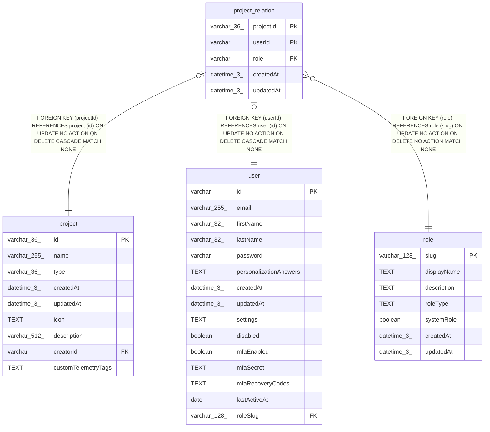

# project_relation

## Description

<details>
<summary><strong>Table Definition</strong></summary>

```sql
CREATE TABLE "project_relation" ("projectId" varchar(36) NOT NULL, "userId" varchar NOT NULL, "role" varchar NOT NULL, "createdAt" datetime(3) NOT NULL DEFAULT (STRFTIME('%Y-%m-%d %H:%M:%f', 'NOW')), "updatedAt" datetime(3) NOT NULL DEFAULT (STRFTIME('%Y-%m-%d %H:%M:%f', 'NOW')), CONSTRAINT "FK_5f0643f6717905a05164090dde7" FOREIGN KEY ("userId") REFERENCES "user" ("id") ON DELETE CASCADE ON UPDATE NO ACTION, CONSTRAINT "FK_61448d56d61802b5dfde5cdb002" FOREIGN KEY ("projectId") REFERENCES "project" ("id") ON DELETE CASCADE ON UPDATE NO ACTION, CONSTRAINT "FK_c6b99592dc96b0d836d7a21db91" FOREIGN KEY ("role") REFERENCES "role" ("slug"), PRIMARY KEY ("projectId", "userId"))
```

</details>

## Columns

| Name | Type | Default | Nullable | Children | Parents | Comment |
| ---- | ---- | ------- | -------- | -------- | ------- | ------- |
| projectId | varchar(36) |  | false |  | [project](project.md) |  |
| userId | varchar |  | false |  | [user](user.md) |  |
| role | varchar |  | false |  | [role](role.md) |  |
| createdAt | datetime(3) | STRFTIME('%Y-%m-%d %H:%M:%f', 'NOW') | false |  |  |  |
| updatedAt | datetime(3) | STRFTIME('%Y-%m-%d %H:%M:%f', 'NOW') | false |  |  |  |

## Constraints

| Name | Type | Definition |
| ---- | ---- | ---------- |
| projectId | PRIMARY KEY | PRIMARY KEY (projectId) |
| userId | PRIMARY KEY | PRIMARY KEY (userId) |
| - (Foreign key ID: 0) | FOREIGN KEY | FOREIGN KEY (role) REFERENCES role (slug) ON UPDATE NO ACTION ON DELETE NO ACTION MATCH NONE |
| - (Foreign key ID: 1) | FOREIGN KEY | FOREIGN KEY (projectId) REFERENCES project (id) ON UPDATE NO ACTION ON DELETE CASCADE MATCH NONE |
| - (Foreign key ID: 2) | FOREIGN KEY | FOREIGN KEY (userId) REFERENCES user (id) ON UPDATE NO ACTION ON DELETE CASCADE MATCH NONE |
| sqlite_autoindex_project_relation_1 | PRIMARY KEY | PRIMARY KEY (projectId, userId) |

## Indexes

| Name | Definition |
| ---- | ---------- |
| project_relation_role_project_idx | CREATE INDEX "project_relation_role_project_idx" ON "project_relation" ("projectId", "role")  |
| project_relation_role_idx | CREATE INDEX "project_relation_role_idx" ON "project_relation" ("role")  |
| IDX_61448d56d61802b5dfde5cdb00 | CREATE INDEX "IDX_61448d56d61802b5dfde5cdb00" ON "project_relation" ("projectId")  |
| IDX_5f0643f6717905a05164090dde | CREATE INDEX "IDX_5f0643f6717905a05164090dde" ON "project_relation" ("userId")  |
| sqlite_autoindex_project_relation_1 | PRIMARY KEY (projectId, userId) |

## Relations



---

> Generated by [tbls](https://github.com/k1LoW/tbls)
