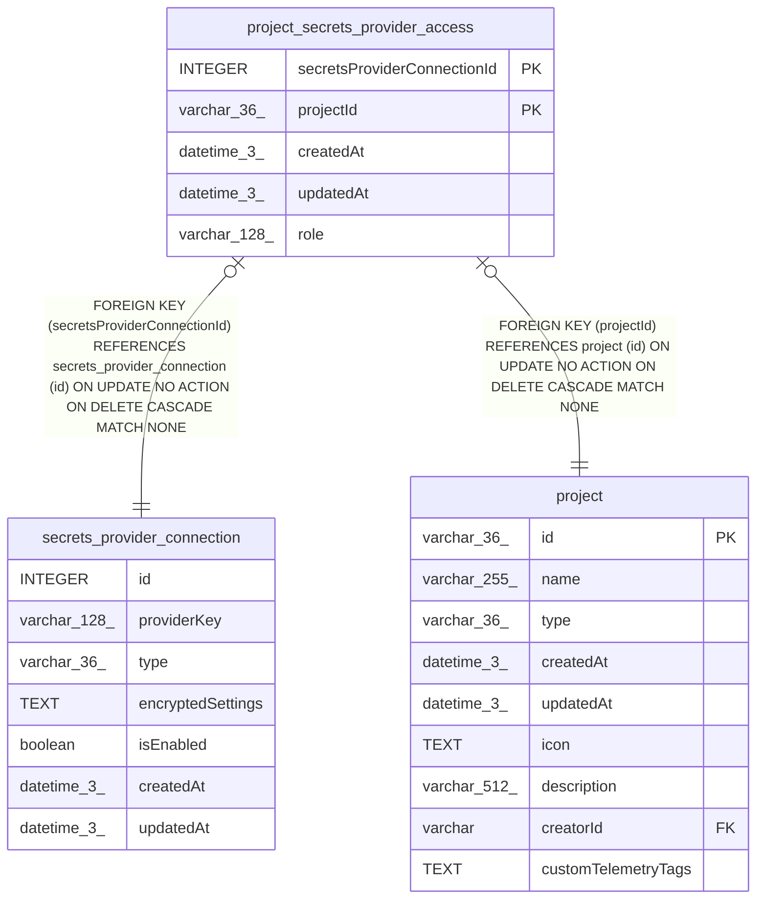

# project_secrets_provider_access

## Description

<details>
<summary><strong>Table Definition</strong></summary>

```sql
CREATE TABLE "project_secrets_provider_access" ("secretsProviderConnectionId" integer NOT NULL, "projectId" varchar(36) NOT NULL, "createdAt" datetime(3) NOT NULL DEFAULT (STRFTIME('%Y-%m-%d %H:%M:%f', 'NOW')), "updatedAt" datetime(3) NOT NULL DEFAULT (STRFTIME('%Y-%m-%d %H:%M:%f', 'NOW')), "role" varchar(128) NOT NULL DEFAULT ('secretsProviderConnection:user'), CONSTRAINT "CHK_project_secrets_provider_access_role" CHECK ("role" IN ('secretsProviderConnection:owner', 'secretsProviderConnection:user')), CONSTRAINT "FK_bd264b81209355b543878deedb1" FOREIGN KEY ("projectId") REFERENCES "project" ("id") ON DELETE CASCADE ON UPDATE NO ACTION, CONSTRAINT "FK_18e5c27d2524b1638b292904e48" FOREIGN KEY ("secretsProviderConnectionId") REFERENCES "secrets_provider_connection" ("id") ON DELETE CASCADE ON UPDATE NO ACTION, PRIMARY KEY ("secretsProviderConnectionId", "projectId"))
```

</details>

## Columns

| Name | Type | Default | Nullable | Children | Parents | Comment |
| ---- | ---- | ------- | -------- | -------- | ------- | ------- |
| secretsProviderConnectionId | INTEGER |  | false |  | [secrets_provider_connection](secrets_provider_connection.md) |  |
| projectId | varchar(36) |  | false |  | [project](project.md) |  |
| createdAt | datetime(3) | STRFTIME('%Y-%m-%d %H:%M:%f', 'NOW') | false |  |  |  |
| updatedAt | datetime(3) | STRFTIME('%Y-%m-%d %H:%M:%f', 'NOW') | false |  |  |  |
| role | varchar(128) | 'secretsProviderConnection:user' | false |  |  |  |

## Constraints

| Name | Type | Definition |
| ---- | ---- | ---------- |
| secretsProviderConnectionId | PRIMARY KEY | PRIMARY KEY (secretsProviderConnectionId) |
| projectId | PRIMARY KEY | PRIMARY KEY (projectId) |
| - (Foreign key ID: 0) | FOREIGN KEY | FOREIGN KEY (secretsProviderConnectionId) REFERENCES secrets_provider_connection (id) ON UPDATE NO ACTION ON DELETE CASCADE MATCH NONE |
| - (Foreign key ID: 1) | FOREIGN KEY | FOREIGN KEY (projectId) REFERENCES project (id) ON UPDATE NO ACTION ON DELETE CASCADE MATCH NONE |
| sqlite_autoindex_project_secrets_provider_access_1 | PRIMARY KEY | PRIMARY KEY (secretsProviderConnectionId, projectId) |
| - | CHECK | CHECK ("role" IN ('secretsProviderConnection:owner', 'secretsProviderConnection:user')) |

## Indexes

| Name | Definition |
| ---- | ---------- |
| sqlite_autoindex_project_secrets_provider_access_1 | PRIMARY KEY (secretsProviderConnectionId, projectId) |

## Relations



---

> Generated by [tbls](https://github.com/k1LoW/tbls)
