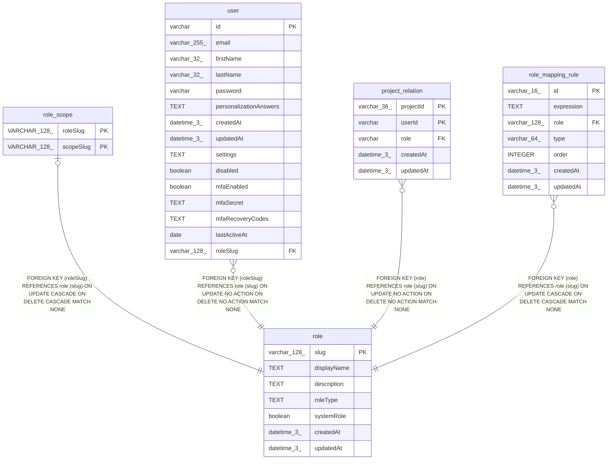

# role

## Description

<details>
<summary><strong>Table Definition</strong></summary>

```sql
CREATE TABLE "role" ("slug" varchar(128) PRIMARY KEY NOT NULL, "displayName" text, "description" text, "roleType" text, "systemRole" boolean NOT NULL DEFAULT (false), "createdAt" datetime(3) NOT NULL DEFAULT (STRFTIME('%Y-%m-%d %H:%M:%f', 'NOW')), "updatedAt" datetime(3) NOT NULL DEFAULT (STRFTIME('%Y-%m-%d %H:%M:%f', 'NOW')))
```

</details>

## Columns

| Name | Type | Default | Nullable | Children | Parents | Comment |
| ---- | ---- | ------- | -------- | -------- | ------- | ------- |
| slug | varchar(128) |  | false | [role_scope](role_scope.md) [user](user.md) [project_relation](project_relation.md) [role_mapping_rule](role_mapping_rule.md) |  |  |
| displayName | TEXT |  | true |  |  |  |
| description | TEXT |  | true |  |  |  |
| roleType | TEXT |  | true |  |  |  |
| systemRole | boolean | false | false |  |  |  |
| createdAt | datetime(3) | STRFTIME('%Y-%m-%d %H:%M:%f', 'NOW') | false |  |  |  |
| updatedAt | datetime(3) | STRFTIME('%Y-%m-%d %H:%M:%f', 'NOW') | false |  |  |  |

## Constraints

| Name | Type | Definition |
| ---- | ---- | ---------- |
| slug | PRIMARY KEY | PRIMARY KEY (slug) |
| sqlite_autoindex_role_1 | PRIMARY KEY | PRIMARY KEY (slug) |

## Indexes

| Name | Definition |
| ---- | ---------- |
| IDX_UniqueRoleDisplayName | CREATE UNIQUE INDEX "IDX_UniqueRoleDisplayName" ON "role" ("displayName") |
| sqlite_autoindex_role_1 | PRIMARY KEY (slug) |

## Relations



---

> Generated by [tbls](https://github.com/k1LoW/tbls)
