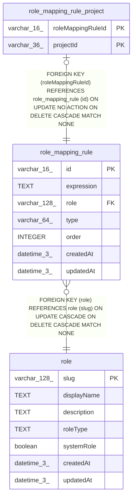

# role_mapping_rule

## Description

<details>
<summary><strong>Table Definition</strong></summary>

```sql
CREATE TABLE "role_mapping_rule" ("id" varchar(16) PRIMARY KEY NOT NULL, "expression" text NOT NULL, "role" varchar(128) NOT NULL, "type" varchar(64) NOT NULL, "order" integer NOT NULL, "createdAt" datetime(3) NOT NULL DEFAULT (STRFTIME('%Y-%m-%d %H:%M:%f', 'NOW')), "updatedAt" datetime(3) NOT NULL DEFAULT (STRFTIME('%Y-%m-%d %H:%M:%f', 'NOW')), CONSTRAINT "UQ_b33ac896ad3099fc8de36fdc1c4" UNIQUE ("type", "order"), CONSTRAINT "FK_bb66e404c35996b0d6946177501" FOREIGN KEY ("role") REFERENCES "role" ("slug") ON DELETE CASCADE ON UPDATE CASCADE)
```

</details>

## Columns

| Name | Type | Default | Nullable | Children | Parents | Comment |
| ---- | ---- | ------- | -------- | -------- | ------- | ------- |
| id | varchar(16) |  | false | [role_mapping_rule_project](role_mapping_rule_project.md) |  |  |
| expression | TEXT |  | false |  |  |  |
| role | varchar(128) |  | false |  | [role](role.md) |  |
| type | varchar(64) |  | false |  |  |  |
| order | INTEGER |  | false |  |  |  |
| createdAt | datetime(3) | STRFTIME('%Y-%m-%d %H:%M:%f', 'NOW') | false |  |  |  |
| updatedAt | datetime(3) | STRFTIME('%Y-%m-%d %H:%M:%f', 'NOW') | false |  |  |  |

## Constraints

| Name | Type | Definition |
| ---- | ---- | ---------- |
| id | PRIMARY KEY | PRIMARY KEY (id) |
| - (Foreign key ID: 0) | FOREIGN KEY | FOREIGN KEY (role) REFERENCES role (slug) ON UPDATE CASCADE ON DELETE CASCADE MATCH NONE |
| sqlite_autoindex_role_mapping_rule_2 | UNIQUE | UNIQUE (type, order) |
| sqlite_autoindex_role_mapping_rule_1 | PRIMARY KEY | PRIMARY KEY (id) |

## Indexes

| Name | Definition |
| ---- | ---------- |
| IDX_bb66e404c35996b0d694617750 | CREATE INDEX "IDX_bb66e404c35996b0d694617750" ON "role_mapping_rule" ("role")  |
| sqlite_autoindex_role_mapping_rule_2 | UNIQUE (type, order) |
| sqlite_autoindex_role_mapping_rule_1 | PRIMARY KEY (id) |

## Relations



---

> Generated by [tbls](https://github.com/k1LoW/tbls)
