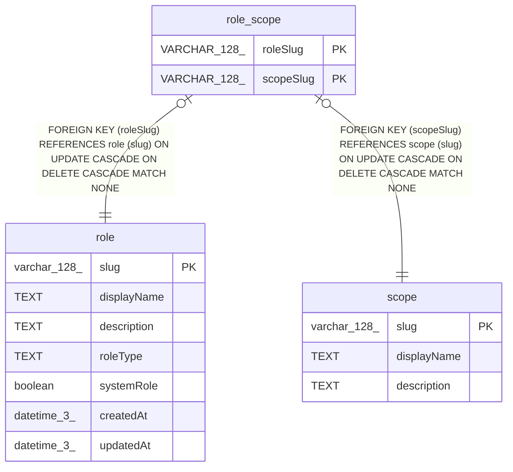

# role_scope

## Description

<details>
<summary><strong>Table Definition</strong></summary>

```sql
CREATE TABLE role_scope (
					"roleSlug" VARCHAR(128) NOT NULL,
					"scopeSlug" VARCHAR(128) NOT NULL,
					CONSTRAINT "PK_role_scope" PRIMARY KEY ("roleSlug", "scopeSlug"),
					CONSTRAINT "FK_role" FOREIGN KEY ("roleSlug") REFERENCES role ("slug") ON DELETE CASCADE ON UPDATE CASCADE,
					CONSTRAINT "FK_scope" FOREIGN KEY ("scopeSlug") REFERENCES "scope" ("slug") ON DELETE CASCADE ON UPDATE CASCADE
				)
```

</details>

## Columns

| Name | Type | Default | Nullable | Children | Parents | Comment |
| ---- | ---- | ------- | -------- | -------- | ------- | ------- |
| roleSlug | VARCHAR(128) |  | false |  | [role](role.md) |  |
| scopeSlug | VARCHAR(128) |  | false |  | [scope](scope.md) |  |

## Constraints

| Name | Type | Definition |
| ---- | ---- | ---------- |
| roleSlug | PRIMARY KEY | PRIMARY KEY (roleSlug) |
| scopeSlug | PRIMARY KEY | PRIMARY KEY (scopeSlug) |
| - (Foreign key ID: 0) | FOREIGN KEY | FOREIGN KEY (scopeSlug) REFERENCES scope (slug) ON UPDATE CASCADE ON DELETE CASCADE MATCH NONE |
| - (Foreign key ID: 1) | FOREIGN KEY | FOREIGN KEY (roleSlug) REFERENCES role (slug) ON UPDATE CASCADE ON DELETE CASCADE MATCH NONE |
| sqlite_autoindex_role_scope_1 | PRIMARY KEY | PRIMARY KEY (roleSlug, scopeSlug) |

## Indexes

| Name | Definition |
| ---- | ---------- |
| IDX_role_scope_scopeSlug | CREATE INDEX "IDX_role_scope_scopeSlug" ON "role_scope" ("scopeSlug")  |
| sqlite_autoindex_role_scope_1 | PRIMARY KEY (roleSlug, scopeSlug) |

## Relations



---

> Generated by [tbls](https://github.com/k1LoW/tbls)
