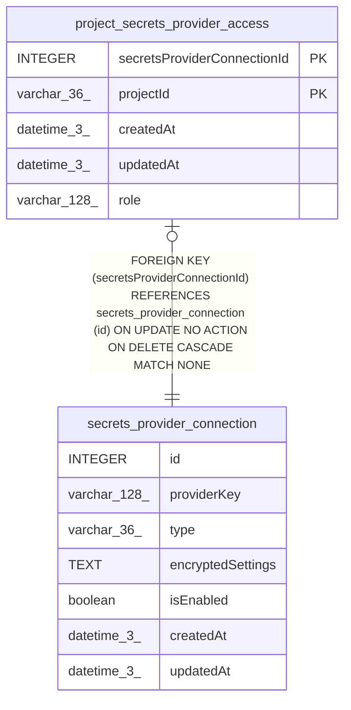

# secrets_provider_connection

## Description

<details>
<summary><strong>Table Definition</strong></summary>

```sql
CREATE TABLE "secrets_provider_connection" ("id" integer PRIMARY KEY NOT NULL, "providerKey" varchar(128) NOT NULL, "type" varchar(36) NOT NULL, "encryptedSettings" text NOT NULL, "isEnabled" boolean NOT NULL DEFAULT (false), "createdAt" datetime(3) NOT NULL DEFAULT (STRFTIME('%Y-%m-%d %H:%M:%f', 'NOW')), "updatedAt" datetime(3) NOT NULL DEFAULT (STRFTIME('%Y-%m-%d %H:%M:%f', 'NOW')))
```

</details>

## Columns

| Name | Type | Default | Nullable | Children | Parents | Comment |
| ---- | ---- | ------- | -------- | -------- | ------- | ------- |
| id | INTEGER |  | false | [project_secrets_provider_access](project_secrets_provider_access.md) |  |  |
| providerKey | varchar(128) |  | false |  |  |  |
| type | varchar(36) |  | false |  |  |  |
| encryptedSettings | TEXT |  | false |  |  |  |
| isEnabled | boolean | false | false |  |  |  |
| createdAt | datetime(3) | STRFTIME('%Y-%m-%d %H:%M:%f', 'NOW') | false |  |  |  |
| updatedAt | datetime(3) | STRFTIME('%Y-%m-%d %H:%M:%f', 'NOW') | false |  |  |  |

## Constraints

| Name | Type | Definition |
| ---- | ---- | ---------- |
| id | PRIMARY KEY | PRIMARY KEY (id) |

## Indexes

| Name | Definition |
| ---- | ---------- |
| IDX_secrets_provider_connection_providerKey | CREATE UNIQUE INDEX "IDX_secrets_provider_connection_providerKey" ON "secrets_provider_connection" ("providerKey")  |

## Relations



---

> Generated by [tbls](https://github.com/k1LoW/tbls)
