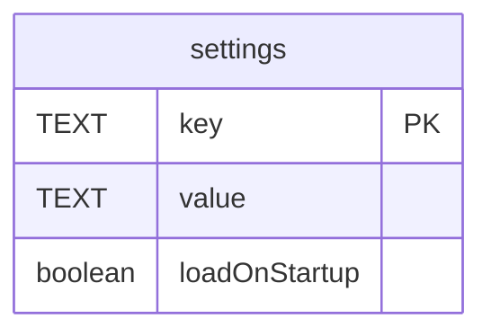

# settings

## Description

<details>
<summary><strong>Table Definition</strong></summary>

```sql
CREATE TABLE "settings" ("key"	TEXT NOT NULL,"value"	TEXT NOT NULL DEFAULT '',"loadOnStartup"	boolean NOT NULL default false,PRIMARY KEY("key"))
```

</details>

## Columns

| Name | Type | Default | Nullable | Children | Parents | Comment |
| ---- | ---- | ------- | -------- | -------- | ------- | ------- |
| key | TEXT |  | false |  |  |  |
| value | TEXT | '' | false |  |  |  |
| loadOnStartup | boolean | false | false |  |  |  |

## Constraints

| Name | Type | Definition |
| ---- | ---- | ---------- |
| key | PRIMARY KEY | PRIMARY KEY (key) |
| sqlite_autoindex_settings_1 | PRIMARY KEY | PRIMARY KEY (key) |

## Indexes

| Name | Definition |
| ---- | ---------- |
| sqlite_autoindex_settings_1 | PRIMARY KEY (key) |

## Relations



---

> Generated by [tbls](https://github.com/k1LoW/tbls)
