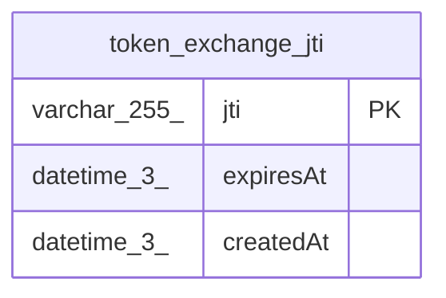

# token_exchange_jti

## Description

<details>
<summary><strong>Table Definition</strong></summary>

```sql
CREATE TABLE "token_exchange_jti" ("jti" varchar(255) PRIMARY KEY NOT NULL, "expiresAt" datetime(3) NOT NULL, "createdAt" datetime(3) NOT NULL)
```

</details>

## Columns

| Name | Type | Default | Nullable | Children | Parents | Comment |
| ---- | ---- | ------- | -------- | -------- | ------- | ------- |
| jti | varchar(255) |  | false |  |  |  |
| expiresAt | datetime(3) |  | false |  |  |  |
| createdAt | datetime(3) |  | false |  |  |  |

## Constraints

| Name | Type | Definition |
| ---- | ---- | ---------- |
| jti | PRIMARY KEY | PRIMARY KEY (jti) |
| sqlite_autoindex_token_exchange_jti_1 | PRIMARY KEY | PRIMARY KEY (jti) |

## Indexes

| Name | Definition |
| ---- | ---------- |
| sqlite_autoindex_token_exchange_jti_1 | PRIMARY KEY (jti) |

## Relations



---

> Generated by [tbls](https://github.com/k1LoW/tbls)
