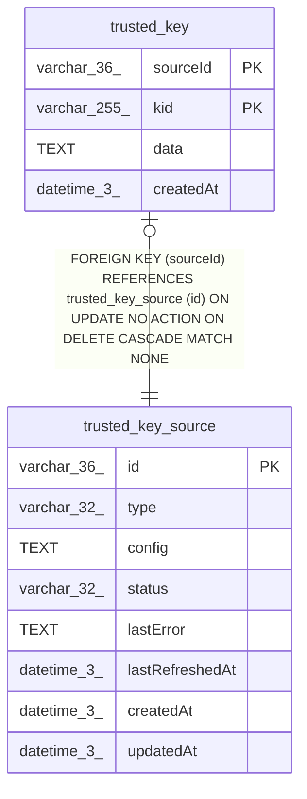

# trusted_key_source

## Description

<details>
<summary><strong>Table Definition</strong></summary>

```sql
CREATE TABLE "trusted_key_source" ("id" varchar(36) PRIMARY KEY NOT NULL, "type" varchar(32) NOT NULL, "config" text NOT NULL, "status" varchar(32) NOT NULL DEFAULT ('pending'), "lastError" text, "lastRefreshedAt" datetime(3), "createdAt" datetime(3) NOT NULL DEFAULT (STRFTIME('%Y-%m-%d %H:%M:%f', 'NOW')), "updatedAt" datetime(3) NOT NULL DEFAULT (STRFTIME('%Y-%m-%d %H:%M:%f', 'NOW')))
```

</details>

## Columns

| Name | Type | Default | Nullable | Children | Parents | Comment |
| ---- | ---- | ------- | -------- | -------- | ------- | ------- |
| id | varchar(36) |  | false | [trusted_key](trusted_key.md) |  |  |
| type | varchar(32) |  | false |  |  |  |
| config | TEXT |  | false |  |  |  |
| status | varchar(32) | 'pending' | false |  |  |  |
| lastError | TEXT |  | true |  |  |  |
| lastRefreshedAt | datetime(3) |  | true |  |  |  |
| createdAt | datetime(3) | STRFTIME('%Y-%m-%d %H:%M:%f', 'NOW') | false |  |  |  |
| updatedAt | datetime(3) | STRFTIME('%Y-%m-%d %H:%M:%f', 'NOW') | false |  |  |  |

## Constraints

| Name | Type | Definition |
| ---- | ---- | ---------- |
| id | PRIMARY KEY | PRIMARY KEY (id) |
| sqlite_autoindex_trusted_key_source_1 | PRIMARY KEY | PRIMARY KEY (id) |

## Indexes

| Name | Definition |
| ---- | ---------- |
| sqlite_autoindex_trusted_key_source_1 | PRIMARY KEY (id) |

## Relations



---

> Generated by [tbls](https://github.com/k1LoW/tbls)
