# user

## Description

<details>
<summary><strong>Table Definition</strong></summary>

```sql
CREATE TABLE "user" ("id" varchar PRIMARY KEY, "email" varchar(255), "firstName" varchar(32), "lastName" varchar(32), "password" varchar, "personalizationAnswers" text, "createdAt" datetime(3) NOT NULL DEFAULT (STRFTIME('%Y-%m-%d %H:%M:%f', 'NOW')), "updatedAt" datetime(3) NOT NULL DEFAULT (STRFTIME('%Y-%m-%d %H:%M:%f', 'NOW')), "settings" text, "disabled" boolean NOT NULL DEFAULT (FALSE), "mfaEnabled" boolean NOT NULL DEFAULT (FALSE), "mfaSecret" text, "mfaRecoveryCodes" text, "lastActiveAt" date, "roleSlug" varchar(128) NOT NULL DEFAULT ('global:member'), CONSTRAINT "UQ_e12875dfb3b1d92d7d7c5377e22" UNIQUE ("email"), CONSTRAINT "FK_eaea92ee7bfb9c1b6cd01505d56" FOREIGN KEY ("roleSlug") REFERENCES "role" ("slug"))
```

</details>

## Columns

| Name | Type | Default | Nullable | Children | Parents | Comment |
| ---- | ---- | ------- | -------- | -------- | ------- | ------- |
| id | varchar |  | true | [auth_identity](auth_identity.md) [project_relation](project_relation.md) [oauth_access_tokens](oauth_access_tokens.md) [oauth_user_consents](oauth_user_consents.md) [dynamic_credential_user_entry](dynamic_credential_user_entry.md) [chat_hub_tools](chat_hub_tools.md) [chat_hub_agents](chat_hub_agents.md) [chat_hub_sessions](chat_hub_sessions.md) [workflow_builder_session](workflow_builder_session.md) [workflow_publish_history](workflow_publish_history.md) [user_favorites](user_favorites.md) [evaluation_collection](evaluation_collection.md) [agent_history](agent_history.md) [instance_ai_pending_confirmations](instance_ai_pending_confirmations.md) [user_api_keys](user_api_keys.md) [project](project.md) [instance_ai_mcp_registry_connections](instance_ai_mcp_registry_connections.md) [oauth_authorization_codes](oauth_authorization_codes.md) [oauth_refresh_tokens](oauth_refresh_tokens.md) |  |  |
| email | varchar(255) |  | true |  |  |  |
| firstName | varchar(32) |  | true |  |  |  |
| lastName | varchar(32) |  | true |  |  |  |
| password | varchar |  | true |  |  |  |
| personalizationAnswers | TEXT |  | true |  |  |  |
| createdAt | datetime(3) | STRFTIME('%Y-%m-%d %H:%M:%f', 'NOW') | false |  |  |  |
| updatedAt | datetime(3) | STRFTIME('%Y-%m-%d %H:%M:%f', 'NOW') | false |  |  |  |
| settings | TEXT |  | true |  |  |  |
| disabled | boolean | FALSE | false |  |  |  |
| mfaEnabled | boolean | FALSE | false |  |  |  |
| mfaSecret | TEXT |  | true |  |  |  |
| mfaRecoveryCodes | TEXT |  | true |  |  |  |
| lastActiveAt | date |  | true |  |  |  |
| roleSlug | varchar(128) | 'global:member' | false |  | [role](role.md) |  |

## Constraints

| Name | Type | Definition |
| ---- | ---- | ---------- |
| id | PRIMARY KEY | PRIMARY KEY (id) |
| - (Foreign key ID: 0) | FOREIGN KEY | FOREIGN KEY (roleSlug) REFERENCES role (slug) ON UPDATE NO ACTION ON DELETE NO ACTION MATCH NONE |
| sqlite_autoindex_user_2 | UNIQUE | UNIQUE (email) |
| sqlite_autoindex_user_1 | PRIMARY KEY | PRIMARY KEY (id) |

## Indexes

| Name | Definition |
| ---- | ---------- |
| user_role_idx | CREATE INDEX "user_role_idx" ON "user" ("roleSlug")  |
| sqlite_autoindex_user_2 | UNIQUE (email) |
| sqlite_autoindex_user_1 | PRIMARY KEY (id) |

## Relations

```mermaid
erDiagram

"auth_identity" }o--o| "user" : "FOREIGN KEY (userId) REFERENCES user (id) ON UPDATE NO ACTION ON DELETE NO ACTION MATCH NONE"
"project_relation" |o--|| "user" : "FOREIGN KEY (userId) REFERENCES user (id) ON UPDATE NO ACTION ON DELETE CASCADE MATCH NONE"
"oauth_access_tokens" }o--|| "user" : "FOREIGN KEY (userId) REFERENCES user (id) ON UPDATE NO ACTION ON DELETE CASCADE MATCH NONE"
"oauth_user_consents" }o--|| "user" : "FOREIGN KEY (userId) REFERENCES user (id) ON UPDATE NO ACTION ON DELETE CASCADE MATCH NONE"
"dynamic_credential_user_entry" |o--|| "user" : "FOREIGN KEY (userId) REFERENCES user (id) ON UPDATE NO ACTION ON DELETE CASCADE MATCH NONE"
"chat_hub_tools" }o--|| "user" : "FOREIGN KEY (ownerId) REFERENCES user (id) ON UPDATE NO ACTION ON DELETE CASCADE MATCH NONE"
"chat_hub_agents" }o--|| "user" : "FOREIGN KEY (ownerId) REFERENCES user (id) ON UPDATE NO ACTION ON DELETE CASCADE MATCH NONE"
"chat_hub_sessions" }o--|| "user" : "FOREIGN KEY (ownerId) REFERENCES user (id) ON UPDATE NO ACTION ON DELETE CASCADE MATCH NONE"
"workflow_builder_session" }o--|| "user" : "FOREIGN KEY (userId) REFERENCES user (id) ON UPDATE NO ACTION ON DELETE CASCADE MATCH NONE"
"workflow_publish_history" }o--o| "user" : "FOREIGN KEY (userId) REFERENCES user (id) ON UPDATE NO ACTION ON DELETE SET NULL MATCH NONE"
"user_favorites" }o--|| "user" : "FOREIGN KEY (userId) REFERENCES user (id) ON UPDATE NO ACTION ON DELETE CASCADE MATCH NONE"
"evaluation_collection" }o--o| "user" : "FOREIGN KEY (createdById) REFERENCES user (id) ON UPDATE NO ACTION ON DELETE SET NULL MATCH NONE"
"agent_history" }o--o| "user" : "FOREIGN KEY (publishedById) REFERENCES user (id) ON UPDATE NO ACTION ON DELETE SET NULL MATCH NONE"
"instance_ai_pending_confirmations" }o--|| "user" : "FOREIGN KEY (userId) REFERENCES user (id) ON UPDATE NO ACTION ON DELETE CASCADE MATCH NONE"
"user_api_keys" }o--|| "user" : "FOREIGN KEY (userId) REFERENCES user (id) ON UPDATE NO ACTION ON DELETE CASCADE MATCH NONE"
"project" }o--o| "user" : "FOREIGN KEY (creatorId) REFERENCES user (id) ON UPDATE NO ACTION ON DELETE SET NULL MATCH NONE"
"instance_ai_mcp_registry_connections" }o--|| "user" : "FOREIGN KEY (userId) REFERENCES user (id) ON UPDATE NO ACTION ON DELETE CASCADE MATCH NONE"
"oauth_authorization_codes" }o--|| "user" : "FOREIGN KEY (userId) REFERENCES user (id) ON UPDATE NO ACTION ON DELETE CASCADE MATCH NONE"
"oauth_refresh_tokens" }o--|| "user" : "FOREIGN KEY (userId) REFERENCES user (id) ON UPDATE NO ACTION ON DELETE CASCADE MATCH NONE"
"user" }o--|| "role" : "FOREIGN KEY (roleSlug) REFERENCES role (slug) ON UPDATE NO ACTION ON DELETE NO ACTION MATCH NONE"

"user" {
  varchar id PK
  varchar_255_ email
  varchar_32_ firstName
  varchar_32_ lastName
  varchar password
  TEXT personalizationAnswers
  datetime_3_ createdAt
  datetime_3_ updatedAt
  TEXT settings
  boolean disabled
  boolean mfaEnabled
  TEXT mfaSecret
  TEXT mfaRecoveryCodes
  date lastActiveAt
  varchar_128_ roleSlug FK
}
"auth_identity" {
  VARCHAR_36_ userId FK
  VARCHAR_64_ providerId PK
  VARCHAR_32_ providerType PK
  timestamp createdAt
  timestamp updatedAt
}
"project_relation" {
  varchar_36_ projectId PK
  varchar userId PK
  varchar role FK
  datetime_3_ createdAt
  datetime_3_ updatedAt
}
"oauth_access_tokens" {
  varchar token PK
  varchar clientId FK
  varchar userId FK
}
"oauth_user_consents" {
  INTEGER id
  varchar userId FK
  varchar clientId FK
  bigint grantedAt
}
"dynamic_credential_user_entry" {
  varchar_16_ credentialId PK
  varchar userId PK
  varchar_16_ resolverId PK
  TEXT data
  datetime_3_ createdAt
  datetime_3_ updatedAt
}
"chat_hub_tools" {
  varchar id PK
  varchar_255_ name
  varchar_255_ type
  REAL typeVersion
  varchar ownerId FK
  TEXT definition
  boolean enabled
  datetime_3_ createdAt
  datetime_3_ updatedAt
}
"chat_hub_agents" {
  varchar id PK
  varchar_256_ name
  varchar_512_ description
  TEXT systemPrompt
  varchar ownerId FK
  varchar_36_ credentialId FK
  varchar_16_ provider
  varchar_64_ model
  datetime_3_ createdAt
  datetime_3_ updatedAt
  TEXT icon
  TEXT files
  TEXT suggestedPrompts
}
"chat_hub_sessions" {
  varchar id PK
  varchar_256_ title
  varchar ownerId FK
  datetime_3_ lastMessageAt
  varchar_36_ credentialId FK
  varchar_16_ provider
  varchar_64_ model
  varchar_36_ workflowId FK
  datetime_3_ createdAt
  datetime_3_ updatedAt
  varchar_36_ agentId FK
  varchar_128_ agentName
  varchar_16_ type
}
"workflow_builder_session" {
  varchar id PK
  varchar_36_ workflowId FK
  varchar userId FK
  TEXT messages
  TEXT previousSummary
  datetime_3_ createdAt
  datetime_3_ updatedAt
  varchar_255_ activeVersionCardId
  varchar_255_ resumeAfterRestoreMessageId
}
"workflow_publish_history" {
  INTEGER id
  varchar_36_ workflowId FK
  varchar_36_ versionId FK
  varchar_36_ event
  varchar userId FK
  datetime_3_ createdAt
}
"user_favorites" {
  INTEGER id
  varchar userId FK
  varchar_255_ resourceId
  varchar_64_ resourceType
}
"evaluation_collection" {
  varchar_36_ id PK
  varchar_128_ name
  TEXT description
  varchar_36_ workflowId FK
  varchar_36_ evaluationConfigId FK
  varchar createdById FK
  TEXT insightsCache
  datetime_3_ createdAt
  datetime_3_ updatedAt
}
"agent_history" {
  varchar_36_ versionId PK
  varchar_36_ agentId FK
  TEXT schema
  TEXT tools
  TEXT skills
  varchar publishedById FK
  varchar_255_ author
  datetime_3_ createdAt
  datetime_3_ updatedAt
}
"instance_ai_pending_confirmations" {
  varchar_36_ requestId PK
  varchar threadId FK
  varchar userId FK
  varchar_16_ kind
  varchar_36_ runId
  varchar_64_ toolCallId
  varchar_36_ messageGroupId
  varchar_255_ checkpointKey FK
  varchar_36_ checkpointTaskId
  datetime_3_ expiresAt
  datetime_3_ createdAt
  datetime_3_ updatedAt
}
"user_api_keys" {
  varchar_36_ id PK
  varchar userId FK
  varchar_100_ label
  varchar apiKey
  datetime_3_ createdAt
  datetime_3_ updatedAt
  TEXT scopes
  varchar audience
  datetime_3_ lastUsedAt
}
"project" {
  varchar_36_ id PK
  varchar_255_ name
  varchar_36_ type
  datetime_3_ createdAt
  datetime_3_ updatedAt
  TEXT icon
  varchar_512_ description
  varchar creatorId FK
  TEXT customTelemetryTags
}
"instance_ai_mcp_registry_connections" {
  varchar id PK
  varchar_36_ credentialId FK
  varchar_255_ serverSlug FK
  TEXT toolFilter
  varchar userId FK
  datetime_3_ createdAt
  datetime_3_ updatedAt
}
"oauth_authorization_codes" {
  varchar_255_ code PK
  varchar clientId FK
  varchar userId FK
  varchar redirectUri
  varchar codeChallenge
  varchar_255_ codeChallengeMethod
  bigint expiresAt
  varchar state
  boolean used
  datetime_3_ createdAt
  datetime_3_ updatedAt
  varchar resource
  TEXT scope
}
"oauth_refresh_tokens" {
  varchar_255_ token PK
  varchar clientId FK
  varchar userId FK
  bigint expiresAt
  datetime_3_ createdAt
  datetime_3_ updatedAt
  TEXT scope
}
"role" {
  varchar_128_ slug PK
  TEXT displayName
  TEXT description
  TEXT roleType
  boolean systemRole
  datetime_3_ createdAt
  datetime_3_ updatedAt
}
```



---

> Generated by [tbls](https://github.com/k1LoW/tbls)
