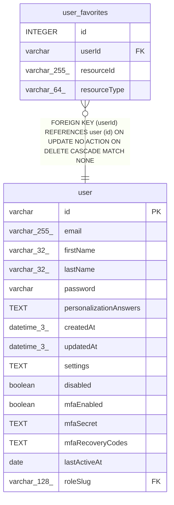

# user_favorites

## Description

<details>
<summary><strong>Table Definition</strong></summary>

```sql
CREATE TABLE "user_favorites" ("id" integer PRIMARY KEY NOT NULL, "userId" varchar NOT NULL, "resourceId" varchar(255) NOT NULL, "resourceType" varchar(64) NOT NULL, CONSTRAINT "UQ_cf6ae658ead9ffc124723413c65" UNIQUE ("userId", "resourceId", "resourceType"), CONSTRAINT "FK_1dd5c393ad0517be3c31a7af836" FOREIGN KEY ("userId") REFERENCES "user" ("id") ON DELETE CASCADE)
```

</details>

## Columns

| Name | Type | Default | Nullable | Children | Parents | Comment |
| ---- | ---- | ------- | -------- | -------- | ------- | ------- |
| id | INTEGER |  | false |  |  |  |
| userId | varchar |  | false |  | [user](user.md) |  |
| resourceId | varchar(255) |  | false |  |  |  |
| resourceType | varchar(64) |  | false |  |  |  |

## Constraints

| Name | Type | Definition |
| ---- | ---- | ---------- |
| id | PRIMARY KEY | PRIMARY KEY (id) |
| - (Foreign key ID: 0) | FOREIGN KEY | FOREIGN KEY (userId) REFERENCES user (id) ON UPDATE NO ACTION ON DELETE CASCADE MATCH NONE |
| sqlite_autoindex_user_favorites_1 | UNIQUE | UNIQUE (userId, resourceId, resourceType) |

## Indexes

| Name | Definition |
| ---- | ---------- |
| IDX_1d11050a381548c42c32cc25c4 | CREATE INDEX "IDX_1d11050a381548c42c32cc25c4" ON "user_favorites" ("resourceType", "resourceId")  |
| IDX_1dd5c393ad0517be3c31a7af83 | CREATE INDEX "IDX_1dd5c393ad0517be3c31a7af83" ON "user_favorites" ("userId")  |
| sqlite_autoindex_user_favorites_1 | UNIQUE (userId, resourceId, resourceType) |

## Relations



---

> Generated by [tbls](https://github.com/k1LoW/tbls)
