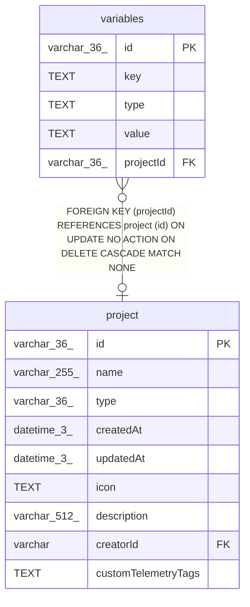

# variables

## Description

<details>
<summary><strong>Table Definition</strong></summary>

```sql
CREATE TABLE "variables" ("id" varchar(36) PRIMARY KEY NOT NULL, "key" text NOT NULL, "type" text NOT NULL DEFAULT ('string'), "value" text, "projectId" varchar(36), CONSTRAINT "FK_a0f13eaa709a21b77a3a9721319" FOREIGN KEY ("projectId") REFERENCES "project" ("id") ON DELETE CASCADE)
```

</details>

## Columns

| Name | Type | Default | Nullable | Children | Parents | Comment |
| ---- | ---- | ------- | -------- | -------- | ------- | ------- |
| id | varchar(36) |  | false |  |  |  |
| key | TEXT |  | false |  |  |  |
| type | TEXT | 'string' | false |  |  |  |
| value | TEXT |  | true |  |  |  |
| projectId | varchar(36) |  | true |  | [project](project.md) |  |

## Constraints

| Name | Type | Definition |
| ---- | ---- | ---------- |
| id | PRIMARY KEY | PRIMARY KEY (id) |
| - (Foreign key ID: 0) | FOREIGN KEY | FOREIGN KEY (projectId) REFERENCES project (id) ON UPDATE NO ACTION ON DELETE CASCADE MATCH NONE |
| sqlite_autoindex_variables_1 | PRIMARY KEY | PRIMARY KEY (id) |

## Indexes

| Name | Definition |
| ---- | ---------- |
| variables_global_key_unique | CREATE UNIQUE INDEX "variables_global_key_unique"<br />			 ON "variables" ("key")<br />			 WHERE projectId IS NULL |
| variables_project_key_unique | CREATE UNIQUE INDEX "variables_project_key_unique" ON "variables" ("projectId", "key")  |
| sqlite_autoindex_variables_1 | PRIMARY KEY (id) |

## Relations



---

> Generated by [tbls](https://github.com/k1LoW/tbls)
