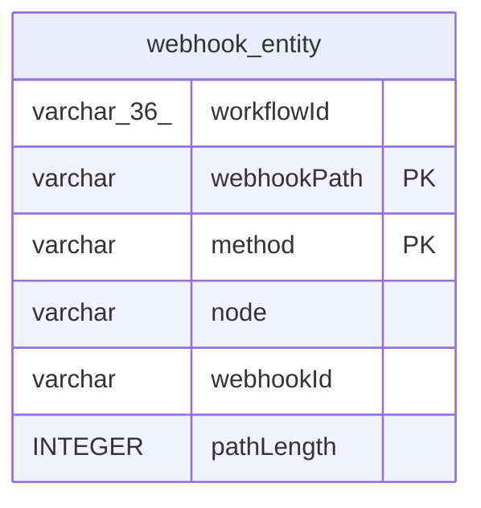

# webhook_entity

## Description

<details>
<summary><strong>Table Definition</strong></summary>

```sql
CREATE TABLE "webhook_entity" ("workflowId" varchar(36) NOT NULL, "webhookPath" varchar NOT NULL, "method" varchar NOT NULL, "node" varchar NOT NULL, "webhookId" varchar, "pathLength" integer, PRIMARY KEY ("webhookPath", "method"))
```

</details>

## Columns

| Name | Type | Default | Nullable | Children | Parents | Comment |
| ---- | ---- | ------- | -------- | -------- | ------- | ------- |
| workflowId | varchar(36) |  | false |  |  |  |
| webhookPath | varchar |  | false |  |  |  |
| method | varchar |  | false |  |  |  |
| node | varchar |  | false |  |  |  |
| webhookId | varchar |  | true |  |  |  |
| pathLength | INTEGER |  | true |  |  |  |

## Constraints

| Name | Type | Definition |
| ---- | ---- | ---------- |
| webhookPath | PRIMARY KEY | PRIMARY KEY (webhookPath) |
| method | PRIMARY KEY | PRIMARY KEY (method) |
| sqlite_autoindex_webhook_entity_1 | PRIMARY KEY | PRIMARY KEY (webhookPath, method) |

## Indexes

| Name | Definition |
| ---- | ---------- |
| idx_webhook_entity_webhook_path_method | CREATE INDEX "idx_webhook_entity_webhook_path_method" ON "webhook_entity" ("webhookId","method","pathLength") |
| sqlite_autoindex_webhook_entity_1 | PRIMARY KEY (webhookPath, method) |

## Relations



---

> Generated by [tbls](https://github.com/k1LoW/tbls)
