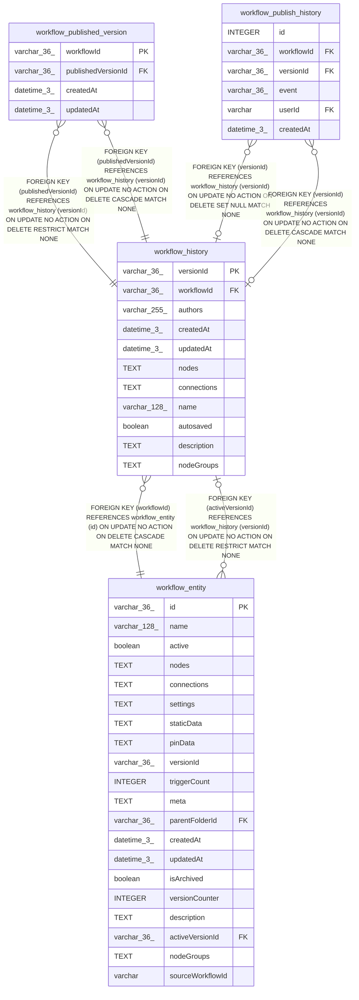

# workflow_history

## Description

<details>
<summary><strong>Table Definition</strong></summary>

```sql
CREATE TABLE "workflow_history" ("versionId" varchar(36) PRIMARY KEY NOT NULL, "workflowId" varchar(36) NOT NULL, "authors" varchar(255) NOT NULL, "createdAt" datetime(3) NOT NULL DEFAULT (STRFTIME('%Y-%m-%d %H:%M:%f', 'NOW')), "updatedAt" datetime(3) NOT NULL DEFAULT (STRFTIME('%Y-%m-%d %H:%M:%f', 'NOW')), "nodes" text NOT NULL, "connections" text NOT NULL, "name" varchar(128), "autosaved" boolean NOT NULL DEFAULT (false), "description" text, "nodeGroups" text NOT NULL DEFAULT ('[]'), CONSTRAINT "FK_1e31657f5fe46816c34be7c1b4b" FOREIGN KEY ("workflowId") REFERENCES "workflow_entity" ("id") ON DELETE CASCADE ON UPDATE NO ACTION)
```

</details>

## Columns

| Name | Type | Default | Nullable | Children | Parents | Comment |
| ---- | ---- | ------- | -------- | -------- | ------- | ------- |
| versionId | varchar(36) |  | false | [workflow_published_version](workflow_published_version.md) [workflow_publish_history](workflow_publish_history.md) [workflow_entity](workflow_entity.md) |  |  |
| workflowId | varchar(36) |  | false |  | [workflow_entity](workflow_entity.md) |  |
| authors | varchar(255) |  | false |  |  |  |
| createdAt | datetime(3) | STRFTIME('%Y-%m-%d %H:%M:%f', 'NOW') | false |  |  |  |
| updatedAt | datetime(3) | STRFTIME('%Y-%m-%d %H:%M:%f', 'NOW') | false |  |  |  |
| nodes | TEXT |  | false |  |  |  |
| connections | TEXT |  | false |  |  |  |
| name | varchar(128) |  | true |  |  |  |
| autosaved | boolean | false | false |  |  |  |
| description | TEXT |  | true |  |  |  |
| nodeGroups | TEXT | '[]' | false |  |  |  |

## Constraints

| Name | Type | Definition |
| ---- | ---- | ---------- |
| versionId | PRIMARY KEY | PRIMARY KEY (versionId) |
| - (Foreign key ID: 0) | FOREIGN KEY | FOREIGN KEY (workflowId) REFERENCES workflow_entity (id) ON UPDATE NO ACTION ON DELETE CASCADE MATCH NONE |
| sqlite_autoindex_workflow_history_1 | PRIMARY KEY | PRIMARY KEY (versionId) |

## Indexes

| Name | Definition |
| ---- | ---------- |
| IDX_1e31657f5fe46816c34be7c1b4 | CREATE INDEX "IDX_1e31657f5fe46816c34be7c1b4" ON "workflow_history" ("workflowId")  |
| sqlite_autoindex_workflow_history_1 | PRIMARY KEY (versionId) |

## Relations



---

> Generated by [tbls](https://github.com/k1LoW/tbls)
