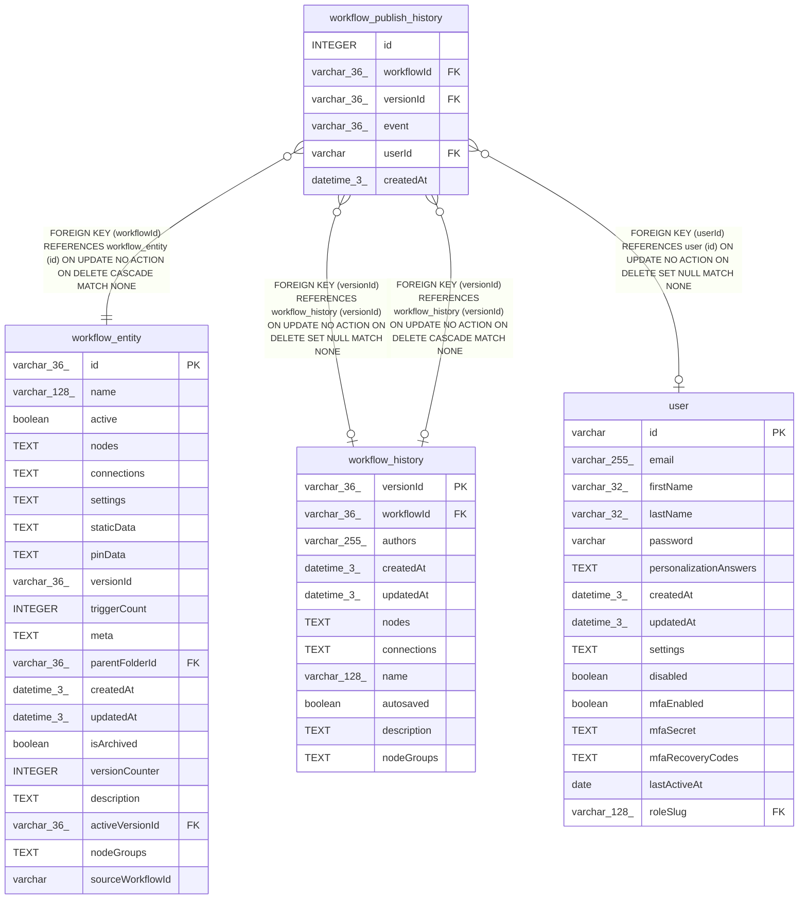

# workflow_publish_history

## Description

<details>
<summary><strong>Table Definition</strong></summary>

```sql
CREATE TABLE "workflow_publish_history" ("id" integer PRIMARY KEY NOT NULL, "workflowId" varchar(36) NOT NULL, "versionId" varchar(36), "event" varchar(36) NOT NULL, "userId" varchar, "createdAt" datetime(3) NOT NULL DEFAULT (STRFTIME('%Y-%m-%d %H:%M:%f', 'NOW')), CONSTRAINT "CHK_workflow_publish_history_event" CHECK ((("event" IN ('activated', 'deactivated')))), CONSTRAINT "FK_c01316f8c2d7101ec4fa9809267" FOREIGN KEY ("workflowId") REFERENCES "workflow_entity" ("id") ON DELETE CASCADE ON UPDATE NO ACTION, CONSTRAINT "FK_b4cfbc7556d07f36ca177f5e473" FOREIGN KEY ("versionId") REFERENCES "workflow_history" ("versionId") ON DELETE CASCADE ON UPDATE NO ACTION, CONSTRAINT "FK_6eab5bd9eedabe9c54bd879fc40" FOREIGN KEY ("userId") REFERENCES "user" ("id") ON DELETE SET NULL ON UPDATE NO ACTION, CONSTRAINT "FK_b4cfbc7556d07f36ca177f5e473" FOREIGN KEY ("versionId") REFERENCES "workflow_history" ("versionId") ON DELETE SET NULL)
```

</details>

## Columns

| Name | Type | Default | Nullable | Children | Parents | Comment |
| ---- | ---- | ------- | -------- | -------- | ------- | ------- |
| id | INTEGER |  | false |  |  |  |
| workflowId | varchar(36) |  | false |  | [workflow_entity](workflow_entity.md) |  |
| versionId | varchar(36) |  | true |  | [workflow_history](workflow_history.md) |  |
| event | varchar(36) |  | false |  |  |  |
| userId | varchar |  | true |  | [user](user.md) |  |
| createdAt | datetime(3) | STRFTIME('%Y-%m-%d %H:%M:%f', 'NOW') | false |  |  |  |

## Constraints

| Name | Type | Definition |
| ---- | ---- | ---------- |
| id | PRIMARY KEY | PRIMARY KEY (id) |
| - (Foreign key ID: 0) | FOREIGN KEY | FOREIGN KEY (versionId) REFERENCES workflow_history (versionId) ON UPDATE NO ACTION ON DELETE SET NULL MATCH NONE |
| - (Foreign key ID: 1) | FOREIGN KEY | FOREIGN KEY (userId) REFERENCES user (id) ON UPDATE NO ACTION ON DELETE SET NULL MATCH NONE |
| - (Foreign key ID: 2) | FOREIGN KEY | FOREIGN KEY (versionId) REFERENCES workflow_history (versionId) ON UPDATE NO ACTION ON DELETE CASCADE MATCH NONE |
| - (Foreign key ID: 3) | FOREIGN KEY | FOREIGN KEY (workflowId) REFERENCES workflow_entity (id) ON UPDATE NO ACTION ON DELETE CASCADE MATCH NONE |
| - | CHECK | CHECK ((("event" IN ('activated', 'deactivated')))) |

## Indexes

| Name | Definition |
| ---- | ---------- |
| IDX_070b5de842ece9ccdda0d9738b | CREATE INDEX "IDX_070b5de842ece9ccdda0d9738b" ON "workflow_publish_history" ("workflowId", "versionId")  |

## Relations



---

> Generated by [tbls](https://github.com/k1LoW/tbls)
