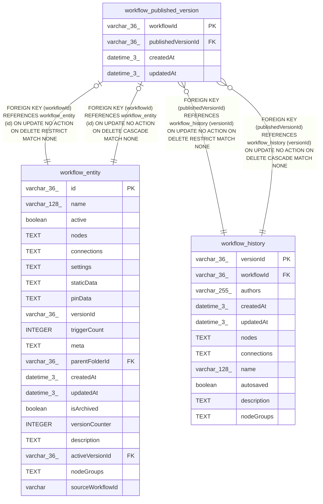

# workflow_published_version

## Description

<details>
<summary><strong>Table Definition</strong></summary>

```sql
CREATE TABLE "workflow_published_version" ("workflowId" varchar(36) PRIMARY KEY NOT NULL, "publishedVersionId" varchar(36) NOT NULL, "createdAt" datetime(3) NOT NULL DEFAULT (STRFTIME('%Y-%m-%d %H:%M:%f', 'NOW')), "updatedAt" datetime(3) NOT NULL DEFAULT (STRFTIME('%Y-%m-%d %H:%M:%f', 'NOW')), CONSTRAINT "FK_df3428a541b802d6a63ac56e330" FOREIGN KEY ("publishedVersionId") REFERENCES "workflow_history" ("versionId") ON DELETE CASCADE ON UPDATE NO ACTION, CONSTRAINT "FK_5c76fb7ee939fe2530374d3f75a" FOREIGN KEY ("workflowId") REFERENCES "workflow_entity" ("id") ON DELETE CASCADE ON UPDATE NO ACTION, CONSTRAINT "FK_5c76fb7ee939fe2530374d3f75a" FOREIGN KEY ("workflowId") REFERENCES "workflow_entity" ("id") ON DELETE RESTRICT, CONSTRAINT "FK_df3428a541b802d6a63ac56e330" FOREIGN KEY ("publishedVersionId") REFERENCES "workflow_history" ("versionId") ON DELETE RESTRICT)
```

</details>

## Columns

| Name | Type | Default | Nullable | Children | Parents | Comment |
| ---- | ---- | ------- | -------- | -------- | ------- | ------- |
| workflowId | varchar(36) |  | false |  | [workflow_entity](workflow_entity.md) |  |
| publishedVersionId | varchar(36) |  | false |  | [workflow_history](workflow_history.md) |  |
| createdAt | datetime(3) | STRFTIME('%Y-%m-%d %H:%M:%f', 'NOW') | false |  |  |  |
| updatedAt | datetime(3) | STRFTIME('%Y-%m-%d %H:%M:%f', 'NOW') | false |  |  |  |

## Constraints

| Name | Type | Definition |
| ---- | ---- | ---------- |
| workflowId | PRIMARY KEY | PRIMARY KEY (workflowId) |
| - (Foreign key ID: 0) | FOREIGN KEY | FOREIGN KEY (publishedVersionId) REFERENCES workflow_history (versionId) ON UPDATE NO ACTION ON DELETE RESTRICT MATCH NONE |
| - (Foreign key ID: 1) | FOREIGN KEY | FOREIGN KEY (workflowId) REFERENCES workflow_entity (id) ON UPDATE NO ACTION ON DELETE RESTRICT MATCH NONE |
| - (Foreign key ID: 2) | FOREIGN KEY | FOREIGN KEY (workflowId) REFERENCES workflow_entity (id) ON UPDATE NO ACTION ON DELETE CASCADE MATCH NONE |
| - (Foreign key ID: 3) | FOREIGN KEY | FOREIGN KEY (publishedVersionId) REFERENCES workflow_history (versionId) ON UPDATE NO ACTION ON DELETE CASCADE MATCH NONE |
| sqlite_autoindex_workflow_published_version_1 | PRIMARY KEY | PRIMARY KEY (workflowId) |

## Indexes

| Name | Definition |
| ---- | ---------- |
| sqlite_autoindex_workflow_published_version_1 | PRIMARY KEY (workflowId) |

## Relations



---

> Generated by [tbls](https://github.com/k1LoW/tbls)
