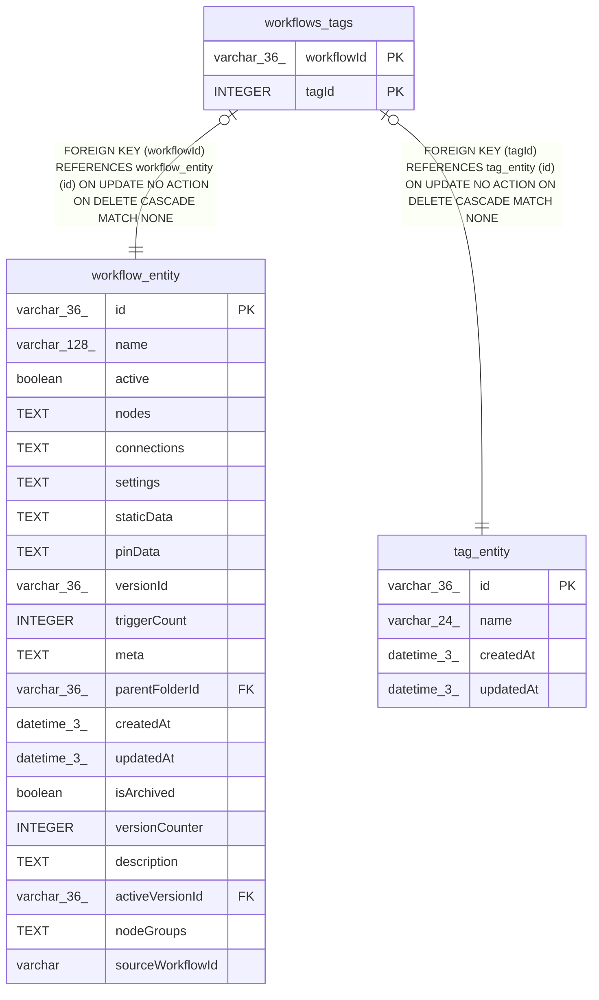

# workflows_tags

## Description

<details>
<summary><strong>Table Definition</strong></summary>

```sql
CREATE TABLE "workflows_tags" ("workflowId" varchar(36) NOT NULL, "tagId" integer NOT NULL, CONSTRAINT "FK_workflows_tags_workflow_entity" FOREIGN KEY ("workflowId") REFERENCES "workflow_entity" ("id") ON DELETE CASCADE ON UPDATE NO ACTION, CONSTRAINT "FK_workflows_tags_tag_entity" FOREIGN KEY ("tagId") REFERENCES "tag_entity" ("id") ON DELETE CASCADE ON UPDATE NO ACTION, PRIMARY KEY ("workflowId", "tagId"))
```

</details>

## Columns

| Name | Type | Default | Nullable | Children | Parents | Comment |
| ---- | ---- | ------- | -------- | -------- | ------- | ------- |
| workflowId | varchar(36) |  | false |  | [workflow_entity](workflow_entity.md) |  |
| tagId | INTEGER |  | false |  | [tag_entity](tag_entity.md) |  |

## Constraints

| Name | Type | Definition |
| ---- | ---- | ---------- |
| workflowId | PRIMARY KEY | PRIMARY KEY (workflowId) |
| tagId | PRIMARY KEY | PRIMARY KEY (tagId) |
| - (Foreign key ID: 0) | FOREIGN KEY | FOREIGN KEY (tagId) REFERENCES tag_entity (id) ON UPDATE NO ACTION ON DELETE CASCADE MATCH NONE |
| - (Foreign key ID: 1) | FOREIGN KEY | FOREIGN KEY (workflowId) REFERENCES workflow_entity (id) ON UPDATE NO ACTION ON DELETE CASCADE MATCH NONE |
| sqlite_autoindex_workflows_tags_1 | PRIMARY KEY | PRIMARY KEY (workflowId, tagId) |

## Indexes

| Name | Definition |
| ---- | ---------- |
| idx_workflows_tags_workflow_id | CREATE INDEX "idx_workflows_tags_workflow_id" ON "workflows_tags" ("workflowId") |
| idx_workflows_tags_tag_id | CREATE INDEX "idx_workflows_tags_tag_id" ON "workflows_tags" ("tagId") |
| sqlite_autoindex_workflows_tags_1 | PRIMARY KEY (workflowId, tagId) |

## Relations



---

> Generated by [tbls](https://github.com/k1LoW/tbls)
